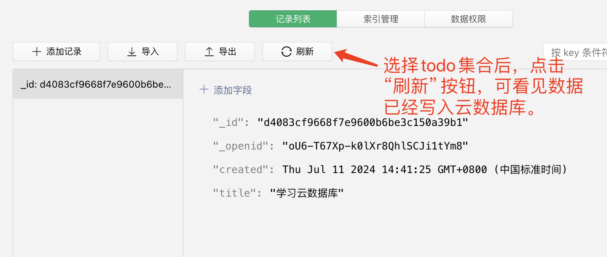

# 小白变大神一：初识云开发数据库

> 《小白变大神，微信小程序云开发快速入门与成本控制实战》系列文章
>
> 第一篇：初识云开发数据库

## 文章系列介绍

[上一篇文章](https://mp.weixin.qq.com/s/Ucnlyjcc6ceAuoLLiG6ktg)发布后，收到许多网友的反馈，说是云开发很好用，就是资源消耗费用太高，用不起，用不起。

根据我自己的经验，云开发在使用时，如果能尽可能的控制好调用次数的资源消耗，这个费用是能接受的，但许多开发者对于资源消耗的控制并不是很好，导致资源消耗成指数增长，费用过高。这里有两方面的原因：

第一个原因是许多开发者是打工心态，开发费用的成本是公司承担，不是自己承担。就算自己花时间优化了资源消耗的调用，公司领导也看不到他的工作价值，然而自己也得不到什么好处。再加上领导不停地催促新功能的上线，加班频繁，时间压力也大，因此开发者往往不会花太多时间在资源消耗的优化上。

第二个原因是许多开发者已经养成了一定的编码习惯，在切换到云开发后会保持原有的编码习惯，也不太愿意花太多的时间去研究如何针对云开发优化代码。

在我学习并使用云开发的过程中，我也踩过许多坑，同时也积累了一些经验和代码库，这些代码库已经针对云开发优化了资源消耗的问题，例如可以仅消耗一次调用次数就能读取上万条数据，或者通过前端缓存减少数据库的读取次数等。

鉴于此，我决定把自己的经验分享出来，写成一个小系列文章。这个系列文章有三个目的：

1. 引导新手快速入门外。如果你有一定的编程经验，但是对云开发不太熟悉，那么本教程能帮助你快速上手云开发；

2. 分享代码库。让大家拿着现成的代码库就能用于自己的项目，而这些代码库已经充分的优化了调用次数的消耗问题，帮你控制成本。装备我给你的代码库，你瞬间就能从小白变大神；

3. 把我在使用云开发的过程中踩过的坑和经验分享给大家，让大家少走弯路，节约时间。

因此，本系列文章的读者需要满足这三个条件：

1. 有一定的编程经验，熟悉JavaScript语言；
2. 对云开发的概念有一定的了解，包含云开发的原理、优缺点、费用等，如果你还不了解可以看我的[上一篇文章](https://mp.weixin.qq.com/s/Ucnlyjcc6ceAuoLLiG6ktg)；
3. 对云开发还不太熟悉，想要快速上手。或正在使用云开发，但觉得云开发费用过高，想要降低成本。

## 新建云开发环境

假设你已经注册了一个微信小程序账号，并且已经购买了云开发环境（个人版19.9元每月），我们从新建项目开始。

如下图所示，请把项目名称改成你自己的项目名称，并填入你自己申请的小程序账号的AppID，然后选择 “微信云开发” -> “云开发基础模板”，开启我们的学习之旅。


新建项目后，默认会有 cloudfunctions/ 和 miniprogram/ 两个目录，其中 cloudfunctions/ 目录是用于存放云函数的，miniprogram/ 目录是用于存放小程序前端代码的。

在新建的项目中会有一些默认的demo代码，我们并不需要这些demo，请根据下面的步骤删除：

1. 删除 cloudfunctions/ 目录下的所有云函数，我们会在后面的文章中自己创建云函数。
2. 删除 miniprogram/components/ 目录，这是demo页面中的组件。
3. 删除 miniprogram/pages/ 目录下的所有文件，我们会自己创建页面。


然后，在pages目录上点击右键，选择“新建文件夹”，输入index，新建一个名为index的目录。


然后，在index目录上点击右键，选择“新建Page”，再次输入index，新建一个名为index的页面，此时会得到index.wxml、index.wxss、index.json、index.js四个文件。


然后用同样的方法再新建一个“todo”页面，我们后面会在这个页面上实现一个todolist应用。

最后，把app.json文件修改成截图中所示样子，在 navigationBarTitleText 这里请输入你自己的项目名称。


好了，这样我们就得到了一个云开发空项目，接下来我们先学习云数据库的使用。

## 初次使用云数据库

我们通过开发一个非常简单todolist页面来学习云数据库，页面中会有“增加todo”、“删除todo”、“完成todo”三项功能。

云开发环境虽然也支持MySQL关系型数据库（需单独购买），但是我并不推荐使用MySQL，因此本教程中我们只使用云开发自带的云数据库，这是一个类似MangoDB的文档型数据库。

首先需要一个数据库表（或称集合，**以后将混用“表”和“集合”，它们同指一个意思**）来存储todo数据，根据下图所示，我们在云开发控制台中新建一个名为todo的集合。


然后我们在微信开发者工具（**以后简称“工具”**）中点击“编译”左边的下拉箭头，如图新建一个编译模式，然后点击“编译”按钮时就能刷新 pages/todo/todo 页面。


### 写入第一条数据

1. 把 pages/todo/todo.wxml 文件替换成下面的代码：

```html
<text>pages/todo/todo.wxml</text>
<button type="primary" bind:tap="test1">写入第一个数据</button>
```

2. 然后把 pages/todo/todo.js 文件替换成下面的代码：

```javascript
'use strict'

Page({

  data: {
  },

  onLoad(options) {
  },

  async test1 (e) {

    getApp().cloud.database().collection('todo').add({
      data: {
        title: '学习云数据库',
        created: new Date(),
      }
    })
    .then(res => {
      console.log(res)
    })

  },

})
```

3. 点击工具的编译按钮（**以后修改代码后可能需要重新编译，我将不再提醒**），然后点击页面中的“写入第一个数据”按钮，你会在控制台中看到类似下图的输出（_id是随机生成的）：


4. 然后，你可以在云开发控制台中的todo表看见一条数据：



*注意：**以后修改数据后都需要手动点击刷新，我将不再提醒**。*

好了，通过上面4个步骤，我们完成了第一条数据的写入。

这里，我假设你已经熟悉JavaScript的 async/await 语法和Promise对象，如果你不熟悉，建议先自学一下。

然后我们来看看这一句写入代码：

```javascript
getApp().cloud.database().collection('todo').add({
  data: {
    title: '学习云数据库',
    created: new Date(),
  }
})
```

getAPP是一个全局函数，通过getApp().cloud获取到了云开发的全局对象（云开发的api都在这个cloud对象中），然后通过database()获取到了数据库对象。

collection('todo')获得todo的集合对象，最后通过add()方法向集合中添加了一条数据，可参考[add函数官方文档](https://developers.weixin.qq.com/miniprogram/dev/wxcloud/reference-sdk-api/database/collection/Collection.add.html)。

到这里，你已经成功向云数据库中写入了一条数据，注意**这个数据并不是存储在你的电脑上，而是存储在微信云端服务器上**。正如我上一篇文章所说，**你不需要关心数据库在哪里、如何连接数据库、数据库的账号密码等（当然，你得有网），你只需要调用云开发的API就能操作数据库。**

### 关注调用次数

在你刚才点击按钮向数据库写入数据时，每点击一次就会消耗一次调用次数，在基础套餐中每月有20万次调用次数资源可用，超过的部分需按照每万次0.5元的价格额外付费（购买资源包会更便宜）。

点击了解[云开发的基础费用](https://developers.weixin.qq.com/miniprogram/dev/wxcloud/billing/price.html#%E6%A6%82%E8%BF%B0)，以及[高级套餐和资源包价格](https://cloud.tencent.com/document/product/876/75213#.E8.B5.84.E6.BA.90.E5.8C.85)。

在本系列教程中，我会特别关注云开发费用问题，而调用次数的消耗又是导致成本过高的主要原因，因此**我会在以后的文章中反复关注调用次数的消耗，并给出降低调用次数的方法和代码库**。

### 自动生成的 _id 与 _openid

上面的写入代码中，我们只指明了title和created两个字段，但是在写入数据库后，我们会发现多出 _id 和 _openid 两个字段（如下图），这是云数据库自动生成的，其中 _id 是每条数据的唯一标识，_openid是写入数据的用户的openid（这里对应你扫码登录工具的微信账号）。


在前端（**前端指微信小程序的开发版本、体验版本、正式版本，而不包含云函数，以后同**），我们可以自己指定_id字段，但**_openid字段是不可指定的**，_openid表示这一条数据是由哪个用户写入的，假如可以自己指定 _openid 字段，那么就可以修改 “别人的数据”，这是不符合逻辑的，也是不安全的。

另外，当我们去读取或修改数据时，如果数据库权限设置了“仅创建者可读写”，那么系统（**“系统”指微信提供的这一套开发和运行环境，以后同**）会自动根据当前用户的_openid去判断是否有读取或修改权限，这也是为什么系统不允许自定义_openid字段的原因。

*注意：这里的 _id 和 _openid 必须有下划线。*

### 和登录页面说拜拜

发现没有，当我们写入数据时，系统会自动强制写入_openid字段，而当我们读取、修改、删除数据时，又会根据_openid字段去判断是否有权限，这样**系统就把数据与用户之间的关系建立起来了，并且没有登录步骤**，也不需要事先调用任何接口获取用户的openid。

站在用户的角度，**用户不需要任何登录页面和登录步骤**，用户可以打开小程序就直接使用，并创建和维护自己的数据。

这里说的强制写入_openid仅限于前端，在后端（**“后端”一词指云函数，以后将混用“后端”和“云函数”**）并不会自动写入_openid字段，并且在云函数中也不需要考虑数据库权限问题，你可以理解成云函数的代码拥有所有权限。


### 用户在不同小程序中的_openid不同

在上一篇文章中我有提到，云开发环境可以共享给多个小程序使用（**最多共享给10个小程序，且小程序需为同一个主体**）。但注意，同一个用户在不同的小程序中_openid是不同的，如果你需要在不同的小程序中识别出他们是同一个用户（同一个微信账号），那么你需要使用UnionID字段，但本教程不涉及UnionID的讨论，你可以自行查阅[微信官方文档](https://developers.weixin.qq.com/minigame/dev/guide/open-ability/union-id.html)。

## 了解数据库权限

### 新、旧两种权限设置

前面说到系统会自动根据_openid字段去判断是否有权限，这是因为新建表时系统默认设置了“仅创建者可读写”权限，如图所示：


如果点击“自定义安全规则”，则会弹出一个权限设置对话框，如下图所示：


我们在自定义安全规则输入框中看见有如下的默认规则：

```json
{
  "read": "doc._openid == auth.openid",
  "write": "doc._openid == auth.openid"
}
```

这里的doc表示集合中的数据，auth表示访问数据库的用户。

从字面意思上看，上面的规则也是“仅创建者可读写”的意思。但是，**这里有一个新手都会踩的坑，这两种权限在实际使用中是有区别的。**

先说结论，请不要使用前面四种权限设置，一律使用“自定义安全规则”，然后再来说说为什么。


上图中的四种权限设置都是旧版本的权限设置，而下面的“自定义安全规则”是新的权限设置。虽然从字面上理解上面两种设置都是“仅创建者可读写”的意思，但是在系统内部，微信对两种权限的处理是不同的，这主要体现在：

1. 当你使用旧的权限设置时，微信会自动为你的查询语句增加 _openid: '{openid}' 条件，假设你有这样一句查询代码：

```javascript
// 假设已存在数据库db对象
db.collection('todo').where({
  title: '我要学习'
}).get()
```

但在实际执行时，微信会自动把这句代码转换成：

```javascript
db.collection('todo').where({
  title: '我要学习',
  _openid: '{openid}'
}).get()
```

这里的 '{openid}' 是指当前用户的openid，对应数据库权限的 auth.openid，这样就实现了前面说的仅能读取自己的数据，避免了读取他人数据的安全问题。

*注意：仅在设置仅用户可读或可写时，系统才会添加 _openid: '{openid}' 条件，在设置 所有用户可读或可写时，系统不会添加 _openid: '{openid}' 条件。*

2. 当你使用新的权限设置时，微信并不会自动帮你添加 _openid: '{openid}' 条件，上面的读取代码会抛出没有权限的错误，如图所示：


*提醒：你以后可能会经常遇到-502003 database permission denied这个错误，不妨现在记录到你的笔记本中，下次遇到了就先排查一下是不是权限设置引起的。*

### 请一律使用新版权限设置

那为什么不直接使用旧的权限设置呢？反正我的小程序功能很简单啊？

哪怕你的小程序功能很简单，也不要使用旧版本，有这么几个原因：

1. 旧的权限设置只有4种基本权限，这明显是不够用的，而新的权限设置可以根据自己的需求设置更复杂的规则。

2. 旧的权限设置，如果你使用“所有用户可读”，此时微信不会自动帮你添加“_openid: '{openid}'”条件，这样就会导致一些表会自动添加“_openid: '{openid}'”语句，而一些表又不会自动添加，这会导致你的代码行为不统一，不好维护。

3. 当你修改表权限设置时，系统会增加或删除“_openid: '{openid}'”条件，你的代码很容易产生bug。

4. 当你某一张表需要使用新版本时，就会出现新、旧两种版本混用的情况，这绝对是噩梦。

**因此，在本系列教程中，我们一律使用新的权限设置，即“自定义安全规则”，我不再重复提醒。**


### 权限的 “覆盖原则”

使用新的权限设置后，只要你的查询语句不符合权限设置的“覆盖原则”，就会抛出上图中的 -502003 database permission denied错误。

什么是数据库权限的“覆盖原则”？我们还是从上面的例子说起。在上面的例子中，我们设置了一个安全规则:

```json
{
  "read": "doc._openid == auth.openid",
  "write": "doc._openid == auth.openid"
}
```

这个规则明确表示，只有用户的openid等于数据的_openid时，才有读写权限。

那么，当你去读取数据时，你的查询条件where中必须有 _openid: '{openid}' 这个条件（新版本中系统不会自动帮你添加），否则就会抛出权限不足的错误。

同样的，当你使用update、delete等操作时，你的查询条件where中也必须有 _openid: '{openid}' 。

下面我们给安全规则增加一点点复杂度，假设安全规则是这样的：

```json
{
  "read": "doc._openid == auth.openid && doc.number > 10"
  "write": "..."
}
```

也就是说，我们只允许读取number大于10的数据，那么我们可能会自然而然的认为 “如果我没有指明number是多少，系统会仅返回number大于10的数据，而number小于等于10的数据不会返回”。

实际情况是，如果你没有指明 “我要查询自己的数据，并且我要number要大于10（或大于11等）的数据”，那么系统会认为你没有权限读取数据，会直接抛出上面的错误，一条数据也不会返回。

因此你的查询语句必须这样写：

```javascript
db.collection('todo').where({
  _openid: '{openid}',
  number: db.command.gt(10), // 或者 db.command.gt(11) 等
  // 其他你想要的条件，但不可以有number小于等于10
}).get()
```

上面这两个条件缺一不可。

总结成一句话就是：**你的查询条件必须覆盖安全规则，否则就抛错**。

*提醒：除了read和write，你还可以使用create、update、delete权限，见[数据库规则编写](https://developers.weixin.qq.com/minigame/dev/wxcloud/guide/database/security-rules.html#%E8%A7%84%E5%88%99%E7%BC%96%E5%86%99)。*

## 区分开发环境与生产环境

假设你觉得当前插入一条数据的功能已经很酷了，你要发布出去给用户使用，然后你会发现一个问题：“**你的开发环境和用户的正式环境写入的是同一个名称为todo的表**”。

我们都是正经的程序员，绝对不会把开发环境的数据和生产环境的数据混在一起，那么我们应该怎么办呢？

上一篇文章中我提到，云开发并不支持在本地电脑上进行调试（这里指脱离云环境），因此你必须使用付费的云环境来开发和测试。

因此，有些开发者会购买两个云环境，一个用于开发和测试，另一个用于生产环境（**提供给用户的正式环境，以后称生产环境**），但我认为这种做法不适合个人或小企业（已有一定用户规模的除外）。首先，多一个开发环境意味着每年要多出240元左右的成本。其次，在开发环境和生产环境之间的数据同步和代码同步是一个很繁琐的事情。

因此，**我个人主张使用同一个云环境进行开发和测试**。为了避免误删数据，我们需要对数据库的接口进行一定的封装，**让开发环境自动访问todo表，而生产环境自动访问p_todo表**（这里的p_前缀表示production）。

*注意：不要使用 “生产环境用todo表，开发环境用dev_todo表” 这种设计思路，因为这样很容易一不小心就修改了生产环境的数据。*

下面请跟随我的步骤实现自动判断：

1. 新建 utils/utils.js 文件：

```javascript
'use strict'

const APP = getApp // 不要在这里执行getApp()，因为可能会返回undefined

const utils = {

  /* === 运行环境 === */

  running () {
    return this.globalData().running
  },

  globalData () {
    return APP().globalData
  },

  /* 判断是否是本地开发环境，当代码在微信开发者工具中运行时返回true，否则返回false
  */
  isLocal () {
    return this.running().is_local
  },

  isWindows () {
    return this.running().is_windows
  },

  isMac () {
    return this.running().is_mac
  },

  /* 判断是否是电脑，包含Windows和Mac
     注意，本地开发环境会返回false
     */
  isPC () {
    const r = this.running()
    return r.is_windows || r.is_mac
  },


  // === 数据库 ===

  /* 返回数据库访问对象
  */
  _db () {
    return APP().cloud.database()
  },

  /* 请使用coll()代替默认的collection函数，以免误操作生产环境的数据
  */
  coll (c) {
    const _ = this
    return _._db().collection(_._collName(c)) // 此文件中只有这里可以写collection
  },

  /* 生产环境下添加p_前缀(all_前缀的集合除外)
  */
  _collName(c){
    const _ = this
    if( !_.isLocal() && !c.startsWith('all_') ){
      c = 'p_' + c
    }
    return c
  },

}

export default utils
```

2. 新建 utils/app_init.js 文件：

```javascript
'use strict'
// 对app进行初始化，以后会在这里添加更多的初始化代码

import utils from 'utils'

/* 初始化运行环境(很重要，决定了后续操作测试数据库还是正式数据库)
*/
const initRunning = (app) => {

  const platform = wx.getDeviceInfo().platform

  app.globalData.running ??= {}
  app.globalData.running.is_local = platform === 'devtools'
  app.globalData.running.is_windows = platform === 'windows'
  app.globalData.running.is_mac = platform === 'mac'

}


/* 这里需要显示传入app, 因为在app.js的App()注册函数执行完成之前, 调用getApp()可能会返回undefined
*/
export default function (app) {

  initRunning(app)

}
```

3. 编辑 app.js 文件，增加app的初始化调用，编辑后的代码大概如下：

```javascript
'use strict'

import appInit from './utils/app_init'

App({

  onLaunch: function () {
    const _ = this // 我习惯使用_表示this

    // 这里是wx.cloud的初始化代码，请保留原样

    appInit(_) // 在这里调用app的初始化函数

  },

  globalData: {}, // 请把globalData的定义移动到这里，onLaunch的外面

});
```

4. 如图所示，请保持相同的文件结构：


好了，现在当你使用如下代码时，就能自动区分开发环境和生产环境：

```javascript
utils.coll('todo').add({
  data: {
    title: '学习云数据库',
    created: new Date(),
  }
})
```

如果是微信开发者工具中运行的（**微信开发者工具就是开发环境，以后同**），就会自动访问todo表，其他情况会自动访问p_todo表。

不过，你还得去云开发后台新建一个p_todo表，然后记得修改数据库权限和todo表一致。


5. 修改 pages/todo/todo.js 文件，把写入数据的代码改成如下：

```javascript
'use strict'

import utils from '../../utils/utils'

Page({

  data: {
  },

  onLoad(options) {
  },

  async test1 (e) {

    utils.coll('todo').add({
      data: {
        title: '学习云数据库',
        created: new Date(),
      }
    })
    .then(res => {
      wx.showToast({
        title: '新增记录成功',
      })
      console.log(res)
    })

  },

})
```

然后在微信开发者工具中点击“写入第一条数据”按钮，你会发现todo表中多了一条数据。

6. 我们再来测试一下在手机中运行，如图所示：


你会发现在手机上执行时，数据是写入到p_todo表中的。并且，当你发布小程序后，用户在使用时也会写入到p_todo表中。

*注意：utils.js代码中有一句 “all_前缀的集合除外”，这是因为后期会有一些表是全局的，不区分开发环境和生产环境，这些表会以all_开头，我们将在后期讲解。*

## 代码库


本系列教程搭配了一个[github代码库：sdjl/WxMpCloudBooster](https://github.com/sdjl/WxMpCloudBooster)，你可以在这里找到文章中的代码：

```sh
# 获取项目
git clone https://github.com/sdjl/WxMpCloudBooster.git
# 切换到文章一对应的代码库
cd WxMpCloudBooster
git checkout article1
```

我每发布一篇文章，就会提交一个commit，你可以使用 git checkout article + n 来切换到第n篇文章对应的代码。

## 下篇预告

在下一篇文章中，我们会进一步完善todolist的功能，并且会进一步讲解数据库的使用和限制，例如如何突破每次20条查询的限制，以及数据库查询每次到底可以查多少数据等。

我还会提供更丰富的代码库，utils.js工具会越来越丰富，你可以把utils.js导入到你自己的项目，实现高效率编码，还能降低成本，最终变成大神。

> 原文作者：微信云开发布道师刘永辉（转载请注明出处）

## 其他

### 文章简介

本文介绍了云数据库的基础，探讨了数据库权限设置的重要性，强调了新的自定义安全规则的使用。文章还介绍了如何区分开发环境和生产环境，以避免数据混淆，并提供了实用的代码示例来帮助开发者有效管理项目。
