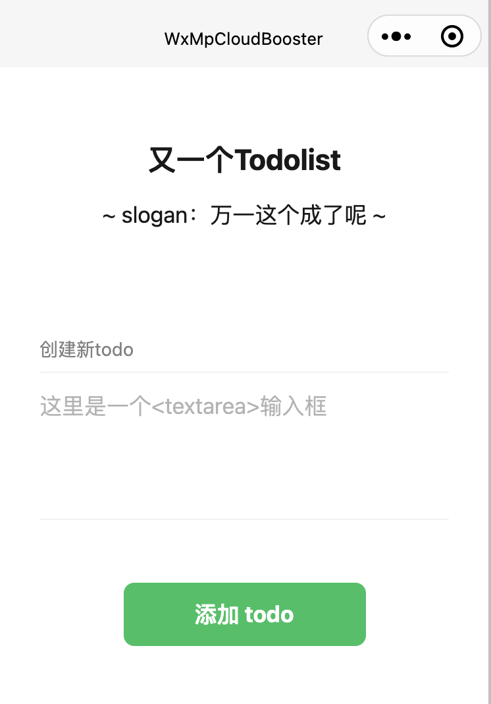
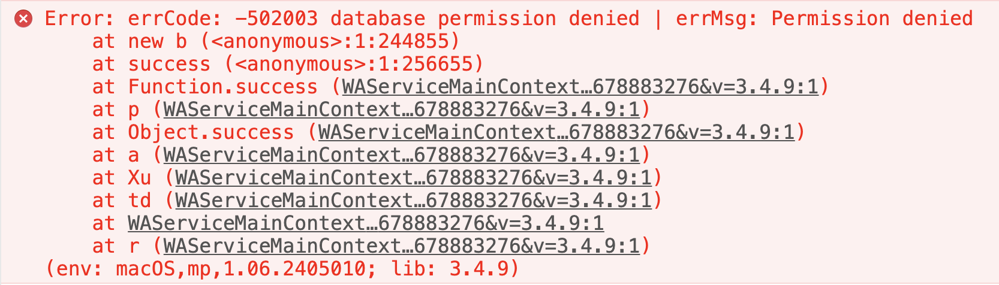
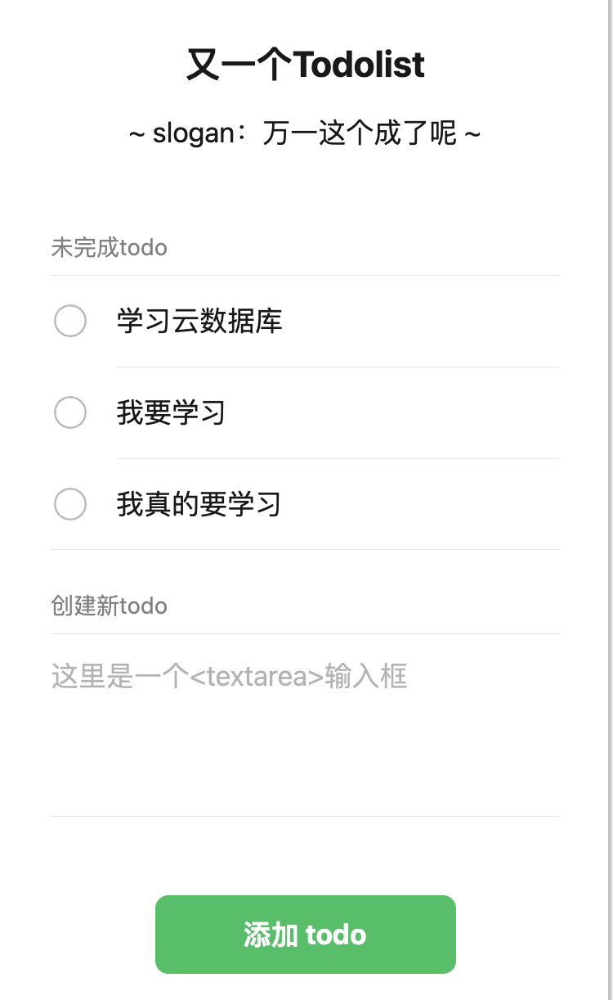
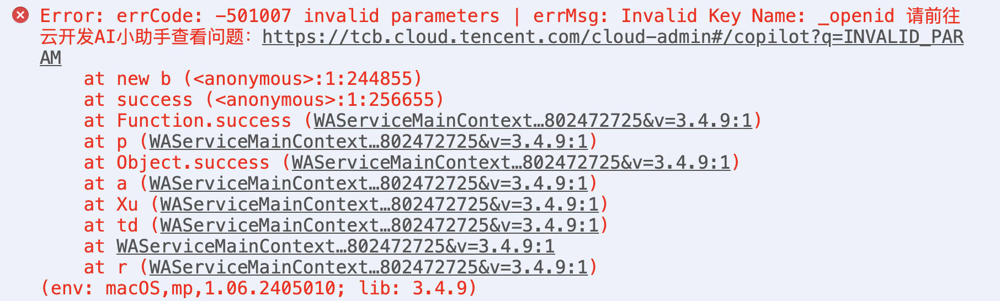
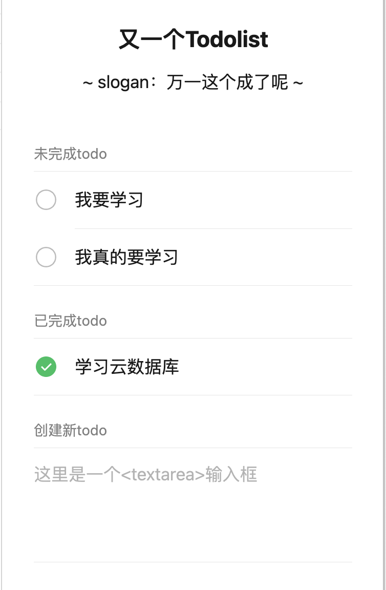

# 小白变大神二：云数据库基础读写工具函数

> 《小白变大神，微信小程序云开发快速入门与成本控制实战》系列文章
>
> 第二篇：云数据库基础读写工具函数


## 前言

在上一篇文章中，我们创建了一个空页面 Todolist，介绍了数据库权限的基础知识，然后通过在表名称的前面添加 p_ 前缀来区分生产环境和开发环境。

阅读本篇文章之前，强烈建议你先阅读上一篇文章：[《小白变大神：一、初识数据库》](https://developers.weixin.qq.com/community/develop/article/doc/0004c2049e8400240fd1706046b813)，并且请根据上一篇文章创建对应的数据库表。

在本篇文章中，我们将继续完善 Todolist 的功能，并提供几个较为基础的数据库读写工具函数。

学习完本篇文章后，你将可直接把读写数据库的代码库应用到你的项目中，提高开发效率。


## Todolist 的写入与刷新

### 使用微信默认样式

考虑到本教程的主要目的是讲解云开发环境的 JavaScript 代码，因此我们在页面UI上使用微信默认方案 WeUI，请向你的 app.json 文件添加下面的配置，这样当你把我的 wxml 代码复制到你的项目中时，你能得到和我一样的页面UI效果。

```json
// 向app.json文件添加下面的配置，让你的页面UI效果和我的一样
{
  "useExtendedLib": {
    "weui": true
  },
  "style": "v2",
}
```

*我假设你已经了解了小程序的 [WeUI](https://developers.weixin.qq.com/miniprogram/dev/platform-capabilities/extended/weui/) 和 [WXML](https://developers.weixin.qq.com/miniprogram/dev/reference/wxml/)。*


### 获取代码库 WxMpCloudBooster

建议你在阅读本系列文章时，自己新建一个项目，然后跟着我的步骤在你的电脑上实践。因此，在本篇文章中，你需要先获取`WxMpCloudBooster`库中的代码。

你可以在[github代码库：sdjl/WxMpCloudBooster](https://github.com/sdjl/WxMpCloudBooster)下载，或者使用如下的命令：

```bash
# 获取项目
git clone https://github.com/sdjl/WxMpCloudBooster.git

# 切换到本篇文章（文章二）对应的代码库
cd WxMpCloudBooster
git checkout article2
```

*注意：建议 checkout 到 article2，否则你拿到的代码可能和本文中不一致*

### 添加 Todolist 页面UI

获取 WxMpCloudBooster 项目代码并切换到 article2 分支后，请你复制 miniprogram/pages/todo/todo.wxml 文件到你的项目中。刷新页面获得如图所示效果：



*提示：为了减少文章篇幅，我不在文章中放置完整的 wxml 代码，你可以[点击这里跳转查看 article2 的代码](https://github.com/sdjl/WxMpCloudBooster/tree/article2)*


### 数据绑定函数：_inputChange

查看代码库（**代码库指WxMpCloudBooster，以后同**）中的 miniprogram/pages/todo/todo.js 文件，你会看到如下代码：

```javascript
'use strict'

import utils from '../../utils/utils'

Page({

  behaviors: utils.behaviors(),

  data: {
    todo_list: [], // 未完成事项列表
    done_list: [], // 已完成事项列表
    new_title: '', // 新增待办事项的内容，与输入框绑定
  },

  // ...

})
```

首先，我们在 data 中定义了一个 new_title 变量，用于存放 &lt;textarea&gt; 输入框中新建 todo 的内容。但是，当我们在 &lt;textarea&gt; 中输入文字时，系统并不会自动更新 data.new_title 的值，因此我们需要在 wxml 中使用 _inputChange 函数来实现数据绑定。代码如下：

```html
<textarea
  class="weui-textarea"
  value="{{new_title}}"
  bind:input="_inputChange"
  data-field="new_title"
  placeholder="这里是一个<textarea>输入框"
  placeholder-class="weui-input__placeholder"
/>
```

_inputChange 函数可以在代码库的 miniprogram/utils/page_behaviors.js 文件中找到：

```javascript
module.exports = Behavior({

  methods: {

      // page_behaviors.js 中的函数都有下划线 _
      _inputChange(e) {
        const { field } = e.currentTarget.dataset
        this.setData({
          [`${field}`]: e.detail.value
        })
      },

  },

})
```

*我假设你已经了解了小程序的 [事件机制](https://developers.weixin.qq.com/miniprogram/dev/framework/view/wxml/event.html) 和 [Behavior](https://developers.weixin.qq.com/miniprogram/dev/reference/api/Behavior.html)*

为了在 todo.wxml 中使用 _inputChange 函数，我们需要在 todo.js 中引入 behaviors ：

```javascript
Page({

  behaviors: utils.behaviors(),

})
```

这里的 behaviors 是 Page 的一个内置属性，可在 [Page文档中](https://developers.weixin.qq.com/miniprogram/dev/reference/api/Page.html) 查看。

在 utils.js 中可查看 behaviors 函数：

```javascript
const PAGE_BEHAVIORS = require('page_behaviors')

const utils = {

  behaviors(){
    return [ PAGE_BEHAVIORS, ]
  }

}
```

*提醒：当你修改 Behavior 文件时，需要重新编译小程序*

这样，当你在 &lt;teatarea&gt; 中输入文字时，data.new_title 的值会自动更新，从而实现了数据绑定。

*随着本教程的深入，page_behaviors.js 文件的功能会越来越丰富。*


### 写入数据函数：utils.addDoc

假设你已经根据上一篇文章创建了 todo 和 p_todo 表，且两个表的数据库权限均选择了“自定义安全规则”，并使用了如下的安全配置：

```json
{
  "read": "doc._openid == auth.openid",
  "write": "doc._openid == auth.openid"
}
```

为了向 todo 表中写入数据，我们需使用 utils.js 中的 addDoc 函数：

```javascript
addDoc(c, d) {
  const _ = this
  return new Promise((resolve, reject) => {
    _.coll(c).add({ data: d })
      .then(res => {
        resolve(res._id)
      })
      .catch(e => {
        reject(e)
      })
  })
}
```

正如上一篇文章中所说，addDoc 中的 coll 函数会自动根据环境判断使用 todo 还是 p_todo 表。当你在微信开发者工具中运行时，addDoc 会向 todo 表中写入数据，而在生产环境或真机预览时，addDoc 会向 p_todo 表中写入数据，**并且以后提供的所有数据库操作函数都会自动判断**。

然后在 todo.js 中使用 addDoc 函数：

```javascript
async addTodo (e) {
  const _ = this
  const { new_title } = _.data

  utils.addDoc('todo', {title: new_title, status: '未完成'})
    .then(new_todo_id => {
      _.updateTodoList()
      _.setData({
        new_title: '' // 清空输入框
      })
    })
}
```

这样就完成了点击“添加 todo”按钮时创建新 todo 的功能。


### 数据读取函数：utils.docs 与 utils.myDocs

新建 todo 后，需要在 updateTodoList 函数中重新读取 todo_list 列表，并重新渲染页面。

因此我们需要一个读取数据的函数 utils.docs。

但是，在上一篇文章中我们讲到，当你使用“自定义安全规则”且规则中有 auth.openid == doc._openid 时，需要在查询语句中添加 _openid: '{openid}' 条件（否则会抛出没有权限的异常）。

因此，代码库中还提供了 utils.myDocs 函数，此函数专门用于读取上述权限设置的数据。

utils.js 文件中这两个函数的定义如下（完整的代码请查看代码库）：

```javascript
docs ({
  c,
  w = {},
  page_num = 0,
  page_size = 20,
  only = '',
  except = '',
  created = false,
  order_by = {},
  mine = false,
} = {}) {
  // 代码请查看代码库
},

myDocs (args) {
  args.mine = true
  return this.docs(args)
}
```

有了这两个工具函数后，我们就可以在 updateTodoList 函数中重新读取 todo_list，并重新渲染页面。

```javascript
async updateTodoList () {
  const _ = this
  utils.myDocs({c: 'todo', w: {status: '未完成'} })
    .then(docs => {
      _.setData({
        todo_list: docs
      })
    })
}
```

### utils.docs 的参数详解

utils.docs 函数支持多个参数，下面我们来详细解释这些参数的用法：

#### c 参数

c 参数是唯一一个必传的，表示 collection 集合名称。当运行在生产环境时会自动添加 p_ 前缀，因此**请勿在这里输入p_前缀，其他数据库操作函数也一样**。

#### w 参数

w 参数表示查询条件 where，如 w: {status: '未完成'}。

还可以在 w 中使用“点表示法”，如：

```javascript
utils.docs(
  c: 'xxx',
  w: { 'people[0].name': '张三' }
)
```

这里的查询条件规则与官方文档中的规则一致。

#### page_num 和 page_size 参数

page_num 和 page_size 参数用于分页读取数据，page_num 从0开始，page_size 最大为20（微信限制每次最多读取20条数据）。

我个人认为，微信限制前端每次最多读取20条数据主要是为了避免加载时间过长，从而保障用户体验（毕竟有许多小白什么代码都敢写，可查看 [get函数文档](https://developers.weixin.qq.com/miniprogram/dev/wxcloud/reference-sdk-api/database/collection/Collection.get.html)）。

在下篇文章中我会提供 utils.allDocs 函数，可实现仅消耗一次调用次数就能读取所有数据。


#### only 和 except 参数

only 和 except 参数用于控制返回的字段，当你仅需要返回 _id 和 _openid 时，可以这样写：

```javascript
utils.docs(
  c: 'xxx',
  only: '_id, _openid'
)
```

同样的，当你不需要返回 _openid 和 created 字段，其他字段都返回时，可以这样写：

```javascript
utils.docs(
  c: 'xxx',
  except: '_openid, created'
)
```

但是，当你使用 only 时，无论 only 中是否写了 _id，_id 都会返回。除非你同时使用 except 显性排除了 _id，如：

```javascript
utils.docs(
  c: 'xxx',
  only: 'title, content',
  except: '_id'
)
```

这是因为通常使用 only 时，我们实际上需要 _id 字段，但是每次都写 _id 会很麻烦。


#### created 参数

created 参数用于控制是否给返回的数据添加创建时间字段，共有4个字段：created、created_str、yymmdd、hhmmss。

通常你并不需要在创建数据时写入当前时间字段，因为**我们可以从 _id 中分析出创建这个数据的时间**。除非你需要根据此字段进行排序或其他查询操作。

这4个时间字段的格式如下：

- created：javascript 的 Date 对象
- created_str：完整时间字符串，如：'2024-07-26 12:02:00'
- yymmdd：日期，如：'2024-07-26'
- hhmmss：时间，如：'12:02:00'

*注意：如果数据是在云函数中创建的，需要把云函数的时区设置为 UTC+8（即在云函数中添加 TZ=Asia/Shanghai 配置），这个我们以后再详细讲解。*

样例代码如下：

```javascript
const docs = await utils.docs({
  c: 'xxx',
  created: true,
})
console.log(docs[0].created) // Date 时间对象
console.log(docs[0].yymmdd)  // '2024-07-26'
```

#### order_by 参数

order_by 参数用于控制返回数据的排序，当你仅需根据**一个字段升序排序**时，可以直接写字段名，如：

```javascript
utils.docs({
  c: 'xxx',
  order_by: 'rank',
})
```

当需要使用降序或多字段排序时，需传入一个对象，如：

```javascript
utils.docs({
  c: 'xxx',
  order_by: {school: true, grade: 'desc', 'math.score': 0}
})
```

以上查询先按 school 升序，再按 grade 降序，最后按 math.score 降序。

在 order_by 中，'asc'、1 或 true 均表示升序，'desc'、0 或 false 均表示降序。


#### mine 参数与 myDocs 函数

由于我们使用了“自定义安全规则”且读取规则为 auth.openid == doc._openid（**以后简称“自己的数据”**），此时系统要求我们在查询数据时必须在 where 中添加 _openid: '{openid}' 条件，否则会抛出没有权限的异常，如图所示：



当 mine=true 时，docs 函数会自动添加 _openid: '{openid}' 条件。

但这样在阅读代码时语义不直观，因此建议用 myDocs 代替，myDocs 的参数和功能与 docs 一致，只是 mine 参数默认为 true。

以后还会有许多类似的**函数对**，如 getDoc、getMyDoc 等。**记住一个简单的原则即可：使用 utils 库时，当操作“自己的数据”时，请使用对应的 my 函数。**


### 其他依赖工具函数

utils.docs 依赖了其他 utils 中的函数，部分被依赖的函数如下（具体实现请在代码库中查看）：

```javascript
const utils = {

  // 判断值是否为undefined或null
  isNone (i) {},

  // 判断值是否为空对象{}、空数组[]、空字符串''、空内容串'  '、undefined、null
  isEmpty (i) {},

  // 判断值是否为数组
  isArray(i) {},

  // 判断值是object但不是数组、null、undefined
  isObject(i) {},

  // 判断值是否为字符串
  isString(i) {},

  // 拆分字符串，返回数组
  // 函数会过滤掉空字符串，并去除两边的空白
  split (s, char = ' ') {},

  // 判断某个元素是否在数组或对象中
  in (item, arr) {},

  // 从数据_id中获取时间，返回Date对象
  getTimeFromId (id) {},

  // 返回时间的年月日字符串，如：'2023-07-01'
  yymmdd (t) {},

  // 返回时间的时分秒字符串，如：'01:02:03'
  hhmmss (t) {},

  // 返回时间的完整字符串，如：'2023-07-01 01:02:03'
  dateToString (t) {},

}
```

随着本系列教程的深入，utils.js 会提供更多的工具函数，希望能帮你提高开发效率。


### Todolist 列表显示效果

好了，目前我们已经完成了 todo 的添加功能，当你在输入框中输入文字并点击“添加 todo”按钮时，会在页面中显示新的 todo。效果如图所示：




## Todolist 的完成与删除

### 更新数据函数：utils.updateDoc 与 utils.updateMyDoc

utils.js 中提供了数据更新函数，用于更新一个文档，代码如下：

```javascript
updateDoc (c, id, {_openid, _id, ...d}, {mine = false} = {}) {
  const _ = this
  const w = {_id: id}
  return new Promise((resolve, reject) => {
    _.coll(c)
      .where({...w, ...(mine ? {_openid: '{openid}'} : {})})
      .limit(1)
      .update({data: d})
      .then(res => {
        if(res.stats.updated > 0){
          resolve(true)
        } else {
          resolve(false)
        }
      })
      .catch(reject)
  })
},

updateMyDoc (c, id, d) {
  return this.updateDoc(c, id, d, {mine: true})
}
```

同样的，如果要更新“自己的数据”，请使用 updateMyDoc。这两个函数的前三个参数分别表示：

- c：集合名称
- id：文档的 _id
- d：要更新的数据

这里数据 d 可以使用“点表示法”，如：

```javascript
utils.updateDoc('todo', todo_id, { 'author.name': '张三' })
  .then(res => {
    if(res === true){
      console.log('更新成功')
    } else {
      console.log('更新失败')
    }
  })
```

*注意：只有文档存在且数据有变化时，res 才会返回 true。*


### 在 updateDoc 中排除 _openid 和 _id 字段

系统的 update 函数不允许传入 _openid 和 _id 字段，否则会抛出异常，如图所示：



但是，在实际开发中，我们经常会先读取一个 doc 文档，然后修改这个文档后使用当前 doc 去更新，如：

```javascript
const doc = await utils.getDoc('todo', todo_id)

doc.status = '已完成'

// ... 其他修改doc的代码

utils.updateDoc('todo', todo_id, doc) // 这里的 doc 中包含了 _openid 和 _id 字段
```

此时因为 doc 中包含了 _openid 和 _id 字段，所以会抛出上图所示异常。

为了解决这个问题，我们在 updateDoc 函数中使用了解构赋值 {_openid, _id, ...d} 来排除 _openid 和 _id 字段。

现在，你就不需要担心向 updateDoc 和 updateMyDoc 函数传入 _openid 和 _id 了。

> 为什么不直接 ```delete doc._openid``` ？，原因一是你可能需要使用 _id，原因二是可能会引起其他代码的 bug。


### 设置 todo 已完成

为了实现点击 todo 左边的圆圈时把 todo 的状态改为“已完成”，我们先在 todo.wxml 绑定 completeTodo 事件（完整代码请看代码库）：

```html
<label wx:for="{{todo_list}}">
  <view bind:tap="completeTodo" data-id="{{item._id}}">
    <!-- 这里是一个圆圈 -->
  </view>
</label>
```

然后在 todo.js 中实现 completeTodo 函数：

```javascript
async completeTodo (e) {
  const _ = this
  const { id } = e.currentTarget.dataset
  utils.updateMyDoc('todo', id, { status: '已完成' })
    .then(() => {
      _.updateTodoList()
    })
}
```

修改 updateTodoList 函数，把已完成的 todo 放到 data.done_list 中：

```javascript
async updateTodoList () {
  const _ = this

  _.setData({
    todo_list: await utils.myDocs({c: 'todo', w: {status: '未完成'} }),
    done_list: await utils.myDocs({c: 'todo', w: {status: '已完成'} }),
  })

},
```

点击圆圈后，todo 会从未完成移动到已完成中，效果如图所示：



*提示：这里只是为了演示数据库查询功能，实际开发时不应该在 updateTodoList 中读取数据库，以免消耗“调用次数”*


### 删除数据函数：utils.removeDoc 与 utils.removeMyDoc

删除数据的函数如下：

```javascript
removeDoc (c, id, {mine = false} = {}) {
  const _ = this
  const w = {_id: id}
  return new Promise((resolve, reject) => {
    _.coll(c)
      .where({...w, ...(mine ? {_openid: '{openid}'} : {})})
      .limit(1)
      .remove()
      .then(async res => {
        if(res.stats.removed > 0){
          resolve(true)
        } else {
          resolve(false)
        }
      })
      .catch(e => {
        resolve(false)
      })
  })
},

removeMyDoc (c, id) {
  return this.removeDoc(c, id, {mine: true})
}
```

同样删除“自己的数据”时要使用 removeMyDoc 函数。


### 删除 todo

为了简化本教程的操作，我们直接使用 longtap 事件来删除 todo，你可以在未完成和已完成的 todo 中添加如下代码：

```html
<view class="weui-cell__bd"
    bind:longtap="deleteTodo" data-id="{{item._id}}" >
  <view>{{item.title}}</view>
</view>
```

然后在 todo.js 中实现 deleteTodo 函数：

```javascript
async deleteTodo (e) {
  const _ = this
  const { id } = e.currentTarget.dataset
  utils.removeMyDoc('todo', id).then(_.updateTodoList)
}
```

好了，现在你可以长按 todo 来删除它了。


## 代码库

本系列教程搭配了一个[github代码库：sdjl/WxMpCloudBooster](https://github.com/sdjl/WxMpCloudBooster)，你可以在这里找到文章中的代码：

```sh
# 获取项目
git clone https://github.com/sdjl/WxMpCloudBooster.git

# 切换到文章二对应的代码库
cd WxMpCloudBooster
git checkout article2
```

我每发布一篇文章，就会提交一个 commit，你可以使用 git checkout article + n 来切换到第 n 篇文章对应的代码。

## 下篇预告

在下篇文章中，我会进一步介绍更多的数据库读写函数，以及提供云函数中操作数据库的版本，并探讨数据库在使用上有哪些限制。届时我们将结束数据库的基础教程，之后会开启其他内容的学习之旅。

我将会在以后的文章中提供更丰富的代码库，你可以把 utils/ 导入到你自己的项目，实现高效率开发，最终变成大神。

> 原文作者：微信云开发布道师刘永辉（转载请注明出处）


## 其他

### 本文简介

本文主要介绍了如何使用WxMpCloudBooster来实现数据库的增删改查功能，并着重强调了读写“仅创建者可读写”的数据时需要注意的问题，以及介绍了utils.js中的一些工具函数的用法。
