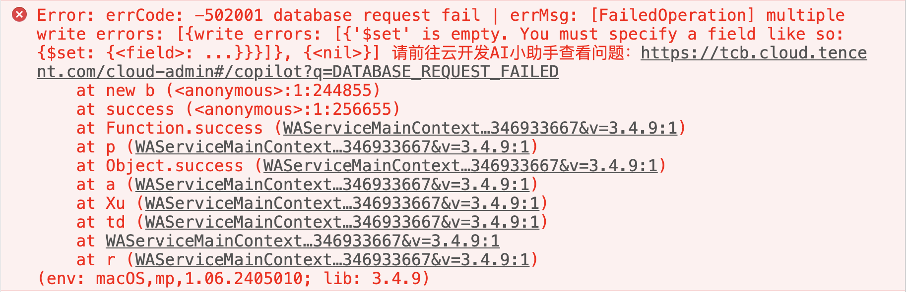

# 小白变大神三：高级数据库工具函数

> 《小白变大神，微信小程序云开发快速入门与成本控制实战》系列文章
>
> 第三篇：高级数据库工具函数


## 前言

在上一篇文章中，我们通过完善 Todolist 的功能，介绍了几个常用数据库操作函数。本篇文章将进一步介绍更多的云数据库工具函数，同时还会提供用于云函数中的版本（云函数中不需要考虑查询权限问题，代码略有不同）。

学习完本篇文章后，云数据库的读写讲解将告一段落，你可以把这三篇文章的代码运用到你的项目中，提高开发效率。

由于这篇文章讲解的函数较多，为了控制文章篇幅，我尽量不在文章中展示代码，建议读者先下载代码库，然后一边阅读文章，一边查看代码。

另外，为了方便读者理解，我为代码库中的函数添加了符合JSDoc规范的注释。


### 获取代码库 WxMpCloudBooster

建议你在阅读本系列文章时，自己新建一个项目，然后跟着我的步骤在你的电脑上实践。因此，在本篇文章中，你需要先获取`WxMpCloudBooster`库中的代码。

你可以在[github代码库：sdjl/WxMpCloudBooster](https://github.com/sdjl/WxMpCloudBooster)下载，或者使用如下的命令：

```bash
# 获取项目
git clone https://github.com/sdjl/WxMpCloudBooster.git

# 切换到本篇文章（文章三）对应的代码库
cd WxMpCloudBooster
git checkout article3
```

*注意：建议 checkout 到 article3，否则你拿到的代码可能和本文中不一致*


## 获取单个文档

### `getDoc`函数

```javascript
/**
 * 根据id获取数据
 *
 * @param {string} c - 集合名称。
 * @param {string} id - 文档的ID。
 * @param {Object} options 包含以下属性的对象:
 *   - {string} only - 仅返回的字段，多个字段用逗号分隔，如：'title, content'。
 *   - {string} except - 不返回的字段。
 *   - {boolean} mine - 是否只读取用户自己的数据。
 *
 * @returns {Promise<Object|null>} Promise对象，解析为文档或null。
 */
getDoc(c, id, {only = '', except = '', mine = false} = {}) {
    // ...
},
```

此函数用于根据文档的ID获取文档。

注意此函数每调用1次就会消耗1次“调用次数”，如果你有一个列表，建议使用docs函数一次读取多个文档并缓存到本地，以减少调用次数。

*上一篇文章我们说到，utils.js中的所有数据库操作函数均会根据当前运行环境自动判断操作测试数据库还是正式数据库。若小程序不在本地运行，则会自动给集合名称添加`p_`前缀，表示访问生产环境的集合表，本文中不再赘述。*


### 关于\*My\*函数

特别注意，当数据库权限设置为“自定义安全规则”且有“auth.openid == doc._openid”规则时，直接使用`getDoc`函数会拿不到数据，返回的doc总是等于null。

此时需要设置`mine`为`true`，或者使用`getMyDoc`函数代替`getDoc`。

utils中的数据库操作函数总是成对出现，如`getDoc`和`getMyDoc`，`docs`和`myDocs`等。

**当需要读取用户自己的数据时，请使用对应的My函数，否则会有权限问题，本文中不再赘述**。


### getOne

与`getDoc`不同，当你并没有文档的ID，而是需要根据某个条件获取一个文档时，可以使用`getOne`函数。

```javascript
/**
 * 通过查询条件获取第一个匹配的文档
 *
 * @param {string} c - 集合名称。
 * @param {Object} w - 查询条件。
 * @param {Object} options 包含以下属性的对象:
 *   - {string} only - 仅返回的字段。
 *   - {string} except - 不返回的字段。
 *   - {boolean} mine - 是否只读取用户自己的数据。
 *   - {Object|string} order_by - 排序规则，与其他函数相同。
 *   - {boolean} last - 是否根据index字段获取index值最大的文档。
 *
 * @returns {Promise<Object|null>} Promise对象，解析为文档或null。
 */
getOne(c, w, {only = '', except = '', mine = false, order_by = {}, last = false} = {}) {
  // ...
},
```

`getOne`是支持排序的，例如当你想要获取“最近一个订单数据”时，可以使用`order_by`对下单时间进行排序。`order_by`参数的用法在上一篇文章中已经介绍过，你也可以在代码库中查看注释详解。

假设要获得最新已完成的订单，可以这样使用：

```javascript
const order = await utils.getOne('order', {status: '已完成'}, {order_by: {finished_time: -1}})
```

这里的`finished_time`表示订单完成时间，`-1`表示降序。


### getMyLastOne

**获取当前用户的最新一个数据是常见需求**，例如用户最近的一个评论，用户最近的一个订单等。

因此在本代码库中，我们引入`index`字段，用于记录文档的创建顺序，然后有些`utils`的函数是基于`index`字段的。

`getMyLastOne`函数是`getOne`的一个封装，用于获取当前用户在指定集合中最新创建的文档：

```javascript
/**
 * 获取当前用户在指定集合中最新创建的文档。
 * 集合中需有index字段，函数返回的是index值最大的文档。
 *
 * @param {string} c - 集合名称。
 * @param {Object} w - 查询条件，默认为空。
 *
 * @returns {Promise<Object|null>} Promise对象，解析为文档或null。
 */
getMyLastOne(c, w = {}) {
  return this.getOne(c, w, {mine: true, last: true})
},
```

如果用户订单表中有`index`字段，你可以这样获取当前用户的最新订单：

```javascript
const order = await utils.getMyLastOne('order')
```

此函数会自动过滤掉其他用户的数据。


### getMyUniqueOne

有时候，我们明确的知道某个表中一个用户只能有一个文档，例如在`user_setting`表中。

此时使用`getMyUniqueOne`函数获取用户的唯一数据，在语义上更加清晰：

```javascript
const us = await utils.getMyUniqueOne('user_setting')
```

注意这里`user_setting`表在设计上`_openid`应该是唯一索引。


## 获取所有文档：`allDocs`函数

上一篇文章中我们介绍了`docs`函数，此函数最多只能读取20个文档（受微信系统限制），但有时候我们需要读取更多的文档，甚至需要读取所有文档。

由于数据库的聚合操作（aggregate）没有单次读取20条的限制，因此我使用`aggregate`实现了`allDocs`函数，用于读取集合中的所有文档。

```javascript
 /**
  * 获取某集合中所有文档数据。
  *
  * @param {Object} options - 配置参数，包括:
  *   - {string} c - 集合名称。
  *   - {Object} match - 匹配条件，默认为空对象。
  *   - {Object} project - 映射阶段
  *   - {Object} sort - 排序条件，默认按 _id 升序。
  *   - {boolean} mine - 是否仅查询用户自己的数据，默认为 false。
  *   - {number} page_size - 每次查询读取的文档数量，默认为 1000，暂无上限。
  *   - {boolean} show_loading - 是否显示加载动画，默认为 false。
  *   - {string} only - 仅包含指定字段。
  *   - {string} except - 排除指定字段。
  *   - {number} limit - 限制读取的文档数量。
  * @returns {Promise<Array>} 返回一个包含查询结果的数组。
  */
 allDocs ({c, match = {}, project = {}, sort = {_id: 1}, mine = false, page_size = 1000, show_loading = false, only = '', except = '', limit = null } = {}) {
  // ...
 }
```

直接调用此函数，会返回集合中的所有数据，如：

```javascript
const all_orders = await utils.allDocs({c: 'order'})
```

但是，此函数实际上会分多次读取，每次读取`page_size`个文档（默认1000），直到读取完所有文档为止。

如果你实际上有3000个订单，那么此函数会读取3次，就会消耗3次调用次数。

为了减少调用次数，你可以把`page_size`设置得更大一些，如3000，这样读取上面的3000个文档就只需要消耗1次调用次数。

但问题是，**系统限制前端每次读取的数据总量不能超过5M**，当单次读取超过5M时，就会报错。因此，如果你的单个文档较大，建议适当减小`page_size`的值（这可能会增加调用次数）。

如果你确保表中所有数据加起来不会超过5MB，那么你可以把`page_size`设置得大一些，如999999，**这样就能实现仅消耗1次调用次数读取所有文档**。


### `limit`参数

有些时候你只是想要“较多数据”，而不是“全部数据”，此时你可以使用`limit`参数，如获得500个最新的订单：

```javascript
const orders = await utils.allDocs({c: 'order', sort: {created: -1}, limit: 500})
```

这里的`limit`参数用于限制读取文档的数量，由于`limit`小于`page_size`，因此只会消耗1次调用次数。

再看个例子，假如`page_size`为1000，`limit`为5000，并且集合中文档数量超过5000个，那么以下的代码会读取5次，只返回5000个文档：

```javascript
// order集合中超过5000个文档
const orders = await utils.allDocs({c: 'order', page_size: 1000, limit: 5000}) // 每次读取1000个文档，直至达到limit的数量
console.log(orders.length) // 5000，消耗5次调用次数
```

### 单个文档超过1M的读取

无论是`getDoc`、`getOne`还是`docs`函数，它们都是普通查询（相对于聚合查询而言）。

对于普通查询，系统限制单次读取的数据总量不能超过1M（对于docs，就是所有文档加起来不能超过1M）。

那么如果你的文档超过1M怎么办？

如果文档大小在1M-5M之间，你可以使用`allDocs`函数配合`limit`参数，如：

```javascript
// allDocs内部使用聚合，聚合可以查询5M以内的文档
const doc = await utils.allDocs({c: 'big_doc', limit: 1})
console.log(doc[0]) // 注意allDocs返回的是数组
```

如果文档超过5M，可以配合`only`参数，分多次读取，每次仅读取部分字段，如：

```javascript
// 读取部分字段
const doc1 = await utils.allDocs({c: 'big_doc', limit: 1, only: 'field1, field2'})
// 读取剩余字段
const doc2 = await utils.allDocs({c: 'big_doc', limit: 1, only: 'field3, field4'})
// 合并字段
const doc = {...doc1[0], ...doc2[0]}
```

你可能会问：“我怎么知道我的文档有没有超过1M”，我将在本文末尾讲解如何判断数据库中文档的大小。


### `allDocs`函数的其他功能

`allDocs`函数内部使用了聚合查询`aggregate`，你可以在[官方文档](https://developers.weixin.qq.com/miniprogram/dev/wxcloud/guide/database/aggregation/aggregation.html)中了解更多关于`aggregate`的用法。

`sort`参数用于排序，使用方法和`docs`中的`order_by`参数相同，但是在使用聚合查询时，我们用`sort`表示排序。

同样的`match`参数与docs中的`w`参数相似，但是在使用聚合时，我们使用`match`命名，以区分普通查询。

`allDocs`函数还支持`project`功能，你可以在[官方文档](https://developers.weixin.qq.com/minigame/dev/wxcloud/reference-sdk-api/database/aggregate/Aggregate.project.html)中了解。

当你同时使用`project`和`sort`时，函数内部会先执行`project`，然后再执行`sort`。

对了，调用`allDocs`函数时用户可能需要等待几秒钟，此时你可以设置`show_loading`参数为`true`，以显示系统默认的loading动画，函数会在数据读取完毕后自动关闭loading动画。


## 其他更新数据函数

### `updateMatch`函数

上篇文章我们介绍了`updateDoc`函数，但`updateDoc`一次只能更新一个文档。

**如果你希望仅消耗1次调用次数，就可批量更新多个文档，可以使用`updateMatch`函数。**

```javascript
/**
 * 批量更新文档。该操作允许更新超过20条文档，上限未知。
 *
 * @param {string} c - 集合名称。
 * @param {Object} w - 匹配被更新文档的条件。
 * @param {Object} d - 需要更新的数据，支持点表示法，如：{'a.b.c': 1}。
 * @param {Object} [options={mine: false}]
 * @returns {Promise<Number>} 返回一个 Promise 对象，解析为更新的文档数量。
 */
updateMatch(c, w, d, {mine = false} = {}) {
  // ...
}
```

若想把所有“未完成”订单的状态都改为“已完成”，可以这样使用：

```javascript
const count = await utils.updateMatch('order', {status: '未完成'}, {status: '已完成'})
```

有时候，你希望只是删除某个字段，例如删除订单的重量字段`weight`，可以这样使用：

```javascript
const $ = utils.command()
const count = await utils.updateMatch('order', {weight: $.exists(true)}, {weight: undefined})
```

上面代码中的第二个参数表示仅修改有`weight`字段的数据，这是可选的。

`updateMatch`有一个限制，即更新时所有匹配的数据设置的值必须是相同的，假如你想给所有订单设置一个`created`字段表示订单创建时间，但每个订单的创建时间是不同的，那么你就不能使用`updateMatch`函数。

微信云数据库的API不支持这种批量更新不同值的操作，但在本文末尾我会提供一种解决方案。


### `undefinedToRemove`函数

在`updateMatch`的第三个参数中，我们设置`weight`为`undefined`，这样就会删除`weight`字段。

但注意，如果你使用微信默认API，当你设置某字段为`undefined`时，系统会抛出异常，如图所示：



但在实际运用中，我们设置一个字段为`undefined`时，我们期望的就是删除这个字段。因此，我在`utils.js`中提供了`undefinedToRemove`函数，并且在`updateMatch`中默认使用了`undefinedToRemove`函数。

```javascript
/**
 * 递归搜索，把对象或数组中所有undefined设置为数据库删除命令。
 * @param {Object|Array} obj - 需要处理的对象或数组。
 * @returns {Object|Array} 返回处理后的新对象或数组。
 */
undefinedToRemove(obj){
  // ...
}
```

传给`undefinedToRemove`函数的参数，可以是一个对象，也可以是一个数组，函数会递归搜索所有值为`undefined`的属性，并替换为[数据库删除命令](https://developers.weixin.qq.com/miniprogram/dev/wxcloud/reference-sdk-api/database/command/Command.remove.html)。

假设你想要删除数据库中的`a.b.c`字段，可以这样写：

```javascript
const doc = {a: {b: {c: undefined}}}
const doc2 = utils.undefinedToRemove(doc)

// 此时doc2.a.b.c的值为数据库删除命令
// 删除一个文档的属性
utils.updateDoc('todo', 'id123', doc2) // updateDoc需要手动调用undefinedToRemove

// 但doc.a.b.c的值仍然为undefined
// 删除多个文档的属性
utils.updateMyMatch('todo', w, doc) // updateMyMatch会自动调用undefinedToRemove
```

### `setDoc`函数

`updateDoc`函数只会更新你在第三个参数`d`中所指定的属性，对于你没有明确指定的属性，`updateDoc`不会做任何更改。

但有时候，你希望把整个文档替换成一个新的对象，而不是更新部分字段。这时你可以使用`setDoc`函数。

```javascript
/**
 * 替换指定ID的文档为新的文档
 * @param {string} c - 集合名称。
 * @param {string} id - 文档的ID。
 * @param {Object} d - 新的文档数据。
 * @returns {Promise<Object>} 返回一个包含创建和更新状态的Promise对象。
 */
setDoc (c, id, d) {
  // ...
}
```

如果`setDoc`指定的id不存在，则会创建一个新的文档。

*提醒：如果能用`updateDoc`，就不要用`setDoc`，因为微信限制每次写入或更新的数据不能超过512KB，使用`setDoc`容易超过这个限制。本文末尾处会进一步讨论数据库的API对数据大小的限制。*


## 其他删除数据函数

### `removeMatch`函数

同样的，上篇文章中的`removeDoc`只能删除一个文档，**若希望仅消耗1次调用次数删除多个文档，可使用`removeMatch`函数**。

```javascript
/**
 * 批量删除匹配条件的文档，可以删除超过20条文档（上限未知）。
 * @param {string} c - 集合名称。
 * @param {Object} w - 匹配被删除的文档的条件。
 * @param {Object} [options={mine: false}] - 可选参数，包括权限控制。
 * @returns {Promise<number>} 返回一个代表被删除文档数量的Promise对象。
 */
removeMatch(c, w, {mine = false} = {}) {
  // ...
}
```

例如删除当前用户所有已完成的todo：

```javascript
const count = await utils.removeMyMatch('todo', {status: '已完成'})
console.log(`删除了 ${count} 个todo`)
```

### `removeAll`函数

开发阶段，你可能需要清空某个表中的所有数据，此时可以使用`removeAll`函数，此函数只需要输入集合名称即可。

```javascript
/**
 * 删除集合中的所有数据。
 * @param {string} c - 集合名称。
 * @returns {Promise<number>} 返回一个代表被删除文档数量的Promise对象。
 */
removeAll(c) {
  // ...
}
```

如果你希望向用户提供一个“清空自己的数据”的功能，可以使用`removeMyAll`函数。


## 其他数据库操作函数

* `exists`：根据文档ID或查询条件判断文档是否存在。

* `count`: 根据查询条件统计文档数量。

* `getMaxFeild`: 获取某个字段的最大值。

* `getMinFeild`: 获取某个字段的最小值。

以上函数的用法请查看代码库中的注释。


## 云函数中的版本

**在云函数中操作数据库时，不需要考虑权限问题，代码默认拥有所有操作权限，因此，云函数中不存在\*My\*函数。**

在`WxMpCloudBooster`代码库中，我为云函数提供了一个专门的文件`for_cloud/utils/utils.js`。

你可以把`for_cloud/utils`目录放在云函数的根目录下，复制后目录结构如下：

```
cloudfunctions/你的云函数名称/utils/utils.js
```

然后使用下面的代码导入云函数的`utils`模块：

```javascript
const sh = require('utils/utils.js')
```

以下是`for_cloud/utils/utils.js`文件中的部分函数，这些函数的功能与前端版本一致，不再赘述。

```javascript
/* 获取数据库查询指令 */
command() {}

/* 获取聚合查询指令 */
aggregate() {}

/* 获取指定集合的引用 */
coll() {}

/* 返回聚合查询对象 */
agg() {}

/* 获取指定集合中的1000条数据（或更多） */
docs() {}

/* 获取指定集合中的所有数据 */
allDocs() {}

/* 更新指定的文档 */
updateDoc() {}

/* 批量更新文档 */
updateMatch() {}

/* 替换指定ID的文档为新的文档 */
setDoc() {}

/* 删除指定的文档 */
removeDoc() {}

/* 批量删除匹配条件的文档 */
removeMatch() {}

/* 根据id获取数据 */
getDoc() {}

/* 通过查询条件获取第一个匹配的文档 */
getOne() {}

/* 向指定集合中添加一个文档 */
addDoc() {}

/* 根据集合名和条件判断数据是否存在 */
exists() {}

/* 获取集合中满足条件的文档数量 */
count() {}

/* 获取指定集合中的最大index值加一 */
getNextIndex() {}

/* 获取集合中某字段的最大值 */
getMaxFeild() {}

/* 获取集合中某字段的最小值 */
getMinFeild() {}
```

### `addDocList`批量插入函数

微信前端的云数据库API是不支持批量插入数据的，但云函数中可以，因此云函数的`utils.js`中提供了`addDocList`函数，用于批量插入数据：

```javascript
/**
 * 批量插入数据到指定的集合中（只有云端可以批量插入）
 * @param {string} c - 集合名称
 * @param {Array} doc_list - 需要插入的文档列表
 * @returns {Promise<Object>} 返回一个Promise，其解析结果为一个对象，包含了插入的文档的ID列表和文档数量
 *
 * @example
 * // 使用示例
 * utils.addDocList('coll', [doc1, doc2, ...])
 *   .then(({ids, len}) => {
 *     console.log(`插入了 ${len} 条数据，ID列表为：${ids}`)
 *   })
 */
addDocList(c, doc_list) {
  // ...
}
```

假设你有一个`doc_list`，里面包含了10000个订单数据，你可以这样插入：

```javascript
const {ids, len} = await utils.addDocList('order', doc_list)
```

在返回的结果中，`ids`是插入的文档的ID列表，`len`是实际插入的文档数量。

你可能好奇，如果通过此函数插入一万条数据，会消耗几次调用次数？幸运的是，**`addDocList`无论插入多少条数据，都只消耗1次调用次数**。

如果前端有批量插入需求，可以在前端把`doc_list`传给云函数，然后在云函数中调用`addDocList`函数。


### 如何批量更新不同值？

前面说到，在实际开发中可能会有这么一种需求，即给不同的数据更新不同的值。这分两种情况：

1. 给多个数据的同一个字段更新不同的值，如需要给每一个订单添加一个created字段，表示这个订单的下单时间，但是每个订单的下单时间是不同的。

2. 给多个数据的不同字段更新不同的值，如有些订单需要添加created字段，但有些订单需要添加updated字段，且每个订单的更新值也都不同。

无论是前端还是云函数中，微信云数据库的API都不支持上述两种批量更新操作。如果你要更新一万个数据，就只能调用一万次`updateDoc`函数，这样就会消耗10000次调用次数。

幸运的是，我们可以使用`addDocList`函数，仅需消耗3次调用次数，就可以实现这种需求，步骤如下：

1. 在云函数中新建一个数据库事务（可选步骤）。
2. 读取所有需要更新的数据，并修改数据（消耗1次）。
3. 使用`removeMatch`或`removeAll`函数删除所有需要更新的数据（消耗1次）。
4. 使用`addDocList`函数插入修改后的数据（消耗1次）。
5. 提交数据库事务（可选步骤）。

这样，你就可以实现批量更新不同数据的需求，且仅消耗3次调用次数，同时数据的`_id`字段不会改变。

*注意：如果你要更新的数据超过了5M，你就不得不分多次处理，见本文末尾的“云端限制“一节。*


### 数据库事务是否可以节约调用次数？

这里你可能会有一个疑问：“在上面的例子中，我使用了数据库的事务功能，那么我只在第5步发起commit时才会访问数据库，会不会应该只消耗一次数据库调用次数呢（因为只有一次commit嘛）？”

很遗憾，**在微信云数据库中，无法通过使用事务减少数据库调用次数**，无论你是否使用事务功能，调用次数的计算方式不变。


### 使用开发者工具导入

对了，除了前面说的使用`addDocList`函数批量插入数据外，你还可以使用开发者工具的导入功能，且不会消耗调用次数。

你可以按照下面这个步骤批量更新数据：

1. 在开发者工具中导出数据；
2. 使用python、js或其他语言修改数据，并输出一个新的json文件；
3. 在开发者工具中导入新的json文件。

不过，这需要你手动操作，若希望程序自动化实现，可使用[云数据库的HTTP API](https://developers.weixin.qq.com/miniprogram/dev/wxcloud/reference-http-api/database/databaseMigrateImport.html)（但这可能会消耗调用次数）。


## 云数据库的限制

### 前端限制

前端操作云数据库时，有以下限制：

1. [get](https://developers.weixin.qq.com/minigame/dev/wxcloud/reference-sdk-api/database/collection/Collection.get.html)请求每次最多读取20条数据，单次返回数据总大小不能超过1M。

2. [聚合](https://developers.weixin.qq.com/minigame/dev/wxcloud/reference-sdk-api/database/collection/Collection.aggregate.html)请求最多读取10000（一万）条数据，单次返回数据总大小不能超过5M。

3. [add](https://developers.weixin.qq.com/minigame/dev/wxcloud/reference-sdk-api/database/collection/Collection.add.html)写入数据操作，单次写入数据不可以超过512KB。

4. [update](https://developers.weixin.qq.com/minigame/dev/wxcloud/reference-sdk-api/database/collection/Collection.update.html)更新数据操作，单次更新数据不可以超过512KB。


### 云端限制

1. [get](https://developers.weixin.qq.com/minigame/dev/wxcloud/reference-sdk-api/database/collection/Collection.get.html)请求默认每次最多读取100条数据，但修改`limit`参数后可以超过100条，上限未知，单次返回数据总大小不能超过50M。

2. [聚合](https://developers.weixin.qq.com/minigame/dev/wxcloud/reference-sdk-api/database/collection/Collection.aggregate.html)请求读取数据条数的上限未知，单次返回数据总大小不能超过50M。

3. [add](https://developers.weixin.qq.com/minigame/dev/wxcloud/reference-sdk-api/database/collection/Collection.add.html)写入数据操作，单次写入数据不可以超过5M。

4. [update](https://developers.weixin.qq.com/minigame/dev/wxcloud/reference-sdk-api/database/collection/Collection.update.html)更新数据操作，单次更新数据不可以超过5M。

5. `addDocList`函数实际使用了`add`操作，因此`addDocList`函数的单次写入数据不可以超过5M。

*注意：以上除“get函数前端20条、云端100条”的限制外，其他限制是我自己测试总结的，微信官方文档中并没有说明，未来微信官方可能会调整这些限制。*


### 如何知道文档的大小？

那么问题来了，我们怎么知道一个文档的大小呢？这里提供一个工具函数：

```javascript
/**
 * 返回一个字符串或对象有多少K（仅保留一位小数）。
 *
 * @param {any} obj - 要计算 K 长度的对象或字符串
 * @returns {string} 返回计算后的 K 长度，保留一位小数
 */
getKLen (obj) {
  // ...
}
```

你可以在调用`addDoc`或`updateDoc`之前，先把整个文档传入`getKLen`函数，然后把文档大小保存到某个变量中，如：

```javascript
const doc = {a: 1, b: 'hello', c: [1, 2, 3]}
const doc.size_k = utils.getKLen(doc) // size_k记录了doc有多少k
utils.addDoc('coll', doc)
```

这样你就可以在微信开发者工具中查看`size_k`的值，如果`size_k`=10，表示这个文档大小为10K左右（注意实际大小会有一定的偏差）。


## 代码库

本系列教程搭配了一个[github代码库：sdjl/WxMpCloudBooster](https://github.com/sdjl/WxMpCloudBooster)，你可以在这里找到文章中的代码：

```sh
# 获取项目
git clone https://github.com/sdjl/WxMpCloudBooster.git

# 切换到文章三对应的代码库
cd WxMpCloudBooster
git checkout article3
```

我每发布一篇文章，就会提交一个 commit，你可以使用 git checkout article + n 来切换到第 n 篇文章对应的代码。


## 下篇预告

好了，到目前为止我们已经通过三篇文章介绍了云数据库的基本操作，数据库的学习将告一个段落，下一篇文章将开启其他内容的学习。

> 原文作者：微信云开发布道师刘永辉（转载请注明出处）


## 其他

### 本文简介

本文提供了微信云数据库的高级操作函数，除前端版本外，还提供了云函数的版本。然后介绍了微信云数据库的一些使用技巧和系统限制。
