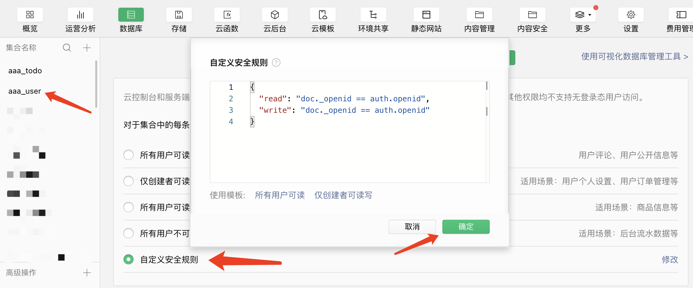
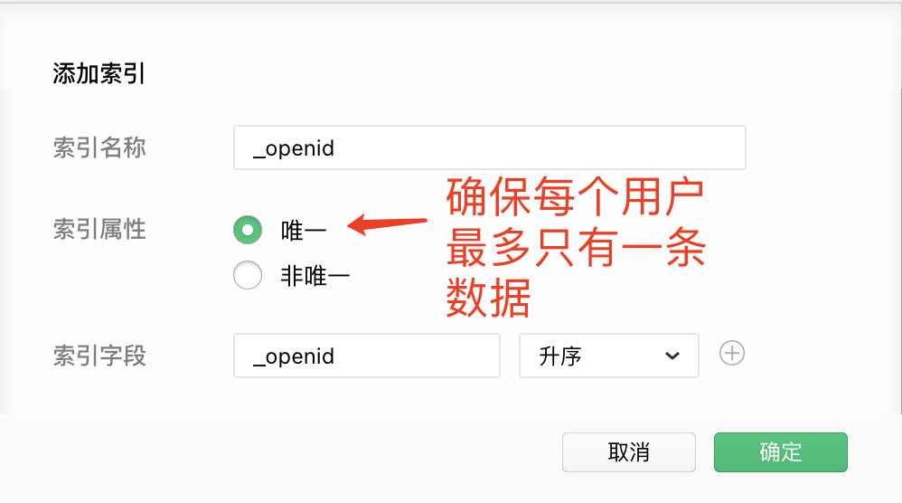
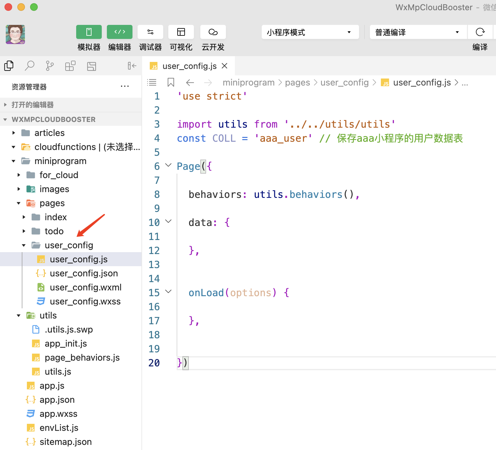
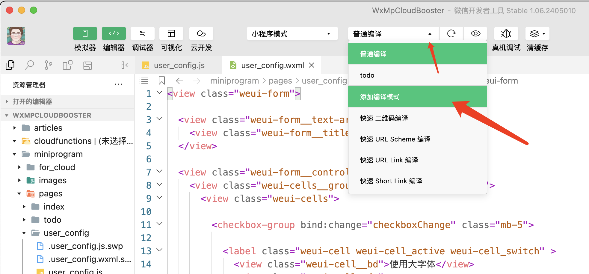
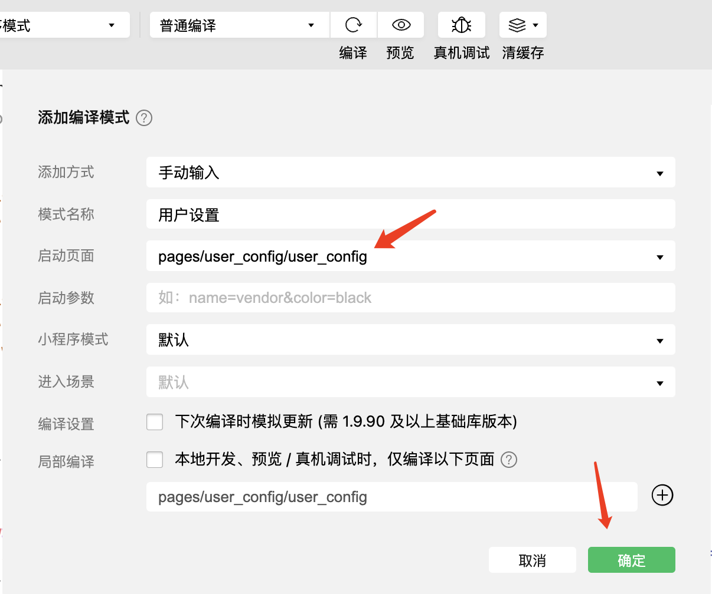
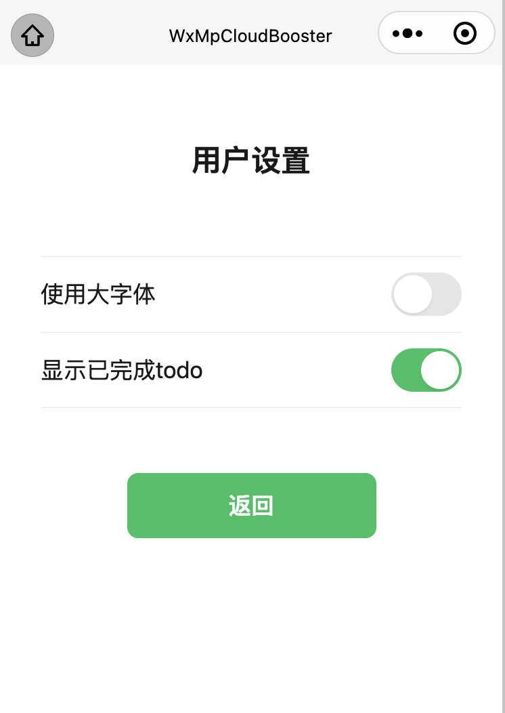
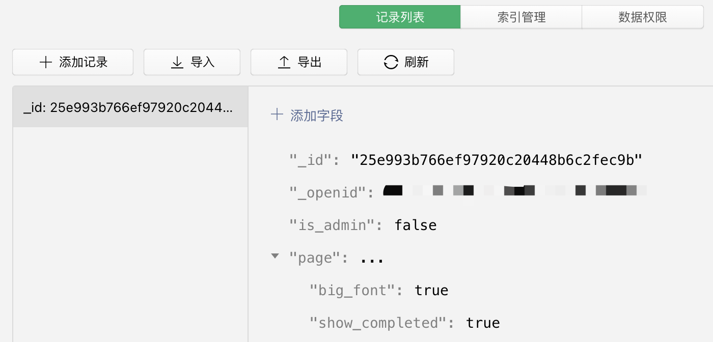
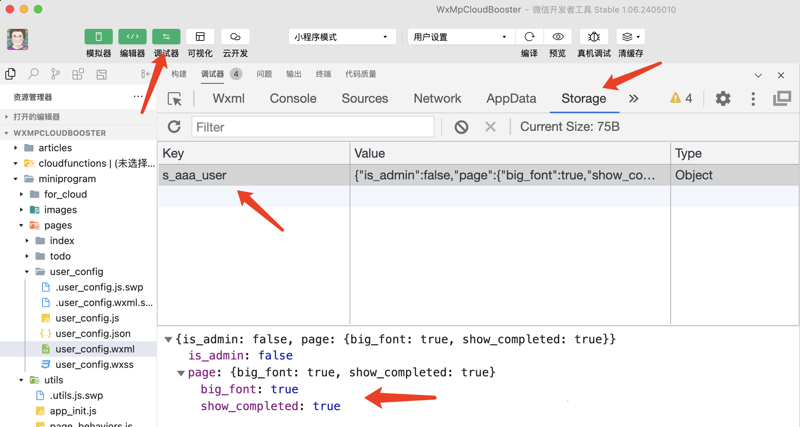
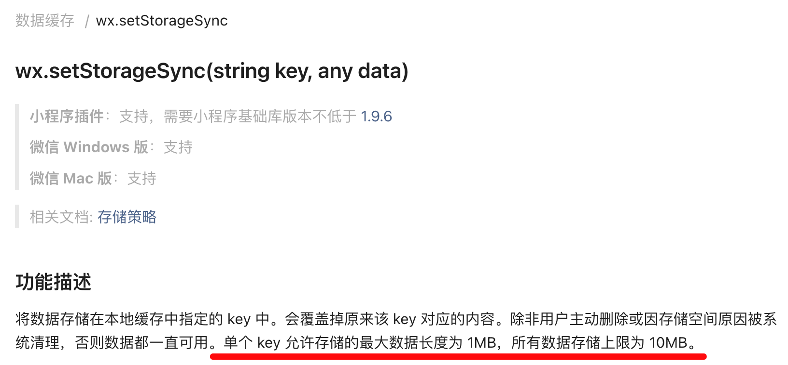
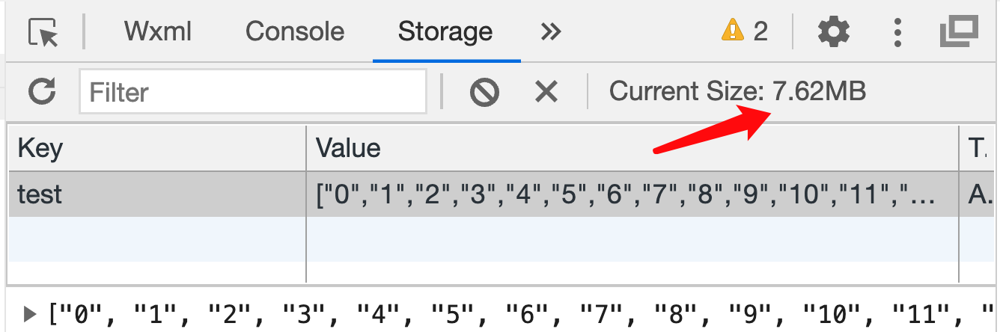

# 小白变大神五：大幅降低微信小程序云数据库的调用次数和成本费用

> 《小白变大神，微信小程序云开发快速入门与成本控制实战》系列文章
>
> 第五篇：大幅降低微信小程序云数据库的调用次数和成本费用

## 前言

在上一篇文章中，我们介绍了如何使用前端`Cache`和`Storage`来缓存用户数据，并通过缓存来减少调用次数的资源消耗。

但除了在前端中缓存数据，我们也需要把用户数据保存到云数据库中。

在本篇文章中，我们将详细介绍与`UserConfig`相关的工具函数。当用户使用你的小程序时，经常需要保存用户的交互数据，例如用户修改了字体的大小、提交了一些文字、阅读了一些文章（需保存最近阅读列表）等等。

如果这些数据内容不是很多，**可以使用`UserConfig`相关函数把这些数据保存到数据库中**，这有以下几个优点：

1. 使用这些工具函数可以让你的小程序代码更加简洁，不需要自己写数据库操作的代码；
2. 当你修改数据库中的数据时，这些工具函数会自动让前端存储（使用`Storage`）与云端数据库保持同步；
3. **这些工具函数已经对调用次数的资源消耗进行了优化，具体表现如下**：

    (1) 当你向数据库写入数据时，只需消耗1次调用次数，就完成了前端存储`Storage`与云数据库的同步写入；如：

    (2) 当你写入的数据实际上没有变化时（与数据库中一致），不会消耗调用次数；

    (3) 当你从数据库中读取数据时，仅在第一次读取时消耗1次调用次数，后续读取数据库操作将不再消耗调用次数（即使读取的是不同的数据字段），因为会从前端`Storage`缓存中读取；

    (4) 即使用户明天或下周或几个月后重新打开了小程序，此时读取数据库依然不会消耗调用次数，因为会从前端`Storage`中读取（上一篇文章说过，`Storage`的存储时间非常长，几乎不会被删除）；

    (5) 通过搭配使用`setUserConfigBuffer`和`flushUserConfigBuffer`函数，可以实现向数据库中写入多条（或多次）数据，但是仅消耗1次调用次数。而在节约资源的同时并不需要改变你的代码逻辑和编码习惯；

**本文中所有保存用户配置数据的`UserConfig`函数都会自动维护前端的`Storage`存储与云数据库之间的自动同步**，你并不需要关心实现细节，只需简单地调用即可。如果你还没有阅读[上一篇文章](https://developers.weixin.qq.com/community/minihome/article/doc/000e6e2be848e898f202a63be61813)，建议你先去阅读，因为上一篇文章中的内容是本篇文章的基础。


### 获取代码库 WxMpCloudBooster

建议你在阅读本系列文章时，自己新建一个项目，然后跟着我的步骤在你的电脑上实践。因此，在本篇文章中，你需要先获取`WxMpCloudBooster`库中的代码。

你可以在[github代码库：sdjl/WxMpCloudBooster](https://github.com/sdjl/WxMpCloudBooster)下载，或者使用如下的命令：

```bash
# 获取项目
git clone https://github.com/sdjl/WxMpCloudBooster.git

# 切换到本篇文章（文章五）对应的代码库
cd WxMpCloudBooster
git checkout article5
```

然后使用类似这样的代码在你的项目中导入`utils`：

```javascript
import utils from '../../utils/utils'
```

## 创建用户设置页面

### 新建 _user 表

微信云开发允许同一个云环境共享给多个小程序使用，为了便于区分哪些表是属于哪个小程序的，我们约定使用小程序的英文名称作为表的前缀。

假设我们有两个小程序，项目的英文名称分别是`aaa`和`bbb`，那么所有`aaa`小程序的表都以`aaa_`开头，`bbb`小程序的表都以`bbb_`开头。

*重构：假设前面的文章中创建的`todo`功能是属于`aaa`小程序的，我们把`todo`表重命名为`aaa_todo`，把`p_todo`表重命名为`p_aaa_todo`。然后再修改`todo`页面的相关代码，把所有操作`todo`表的地方都改为操作`aaa_todo`表。*

然后，为了保存`aaa`小程序的用户数据，我们再分别新建`aaa_user`和`p_aaa_user`两个表，其中`aaa_user`用于开发环境，`p_aaa_user`用于生产环境。然后给这两个表均设置如下的访问权限：

```json
{
  "read": "doc._openid == auth.openid",
  "write": "doc._openid == auth.openid"
}
```

修改权限步骤如图所示：




*提醒：以`_user`结尾只是本系列文章的约定，不是必须的，但我建议你使用这种命名方式，以便于阅读后面的文章。*

**`UserConfig`相关的所有函数都假设同一个用户在同一个表中最多只有一条记录**，因此我们需要为`aaa_user`和`p_aaa_user`表用`_openid`字段建立唯一索引（需删除默认的_openid索引），如图所示：




### 添加页面wxml

为了演示`UserConfig`相关函数，我们新建一个设置页面，并让用户在页面中勾选“是否使用大字体”、“是否显示已完成的`todo`”两个设置。然后我们把这两个设置保存到数据库中。

请在`./pages/user_config/`下创建`user_config`页面，如图所示：



然后把下面的代码复制到你的`user_config.wxml`文件中：

```html
<view class="weui-form">

  <view class="weui-form__text-area">
    <view class="weui-form__title">用户设置</view>
  </view>

  <view class="weui-form__control-area">
    <view class="weui-cells__group weui-cells__group_form">
      <view class="weui-cells">

        <checkbox-group bind:change="checkboxChange" class="mb-5">

          <label class="weui-cell weui-cell_active weui-cell_switch" >
            <view class="weui-cell__bd">使用大字体</view>
            <view class="weui-cell__ft">
              <view>
                <checkbox class="weui-switch-cp__input" checked="{{page.big_font}}" value="big_font" />
                <view class="weui-switch-cp__box"></view>
              </view>
            </view>
          </label>

          <label class="weui-cell weui-cell_active weui-cell_switch" >
            <view class="weui-cell__bd">显示已完成todo</view>
            <view class="weui-cell__ft">
              <view>
                <checkbox class="weui-switch-cp__input" checked="{{page.show_completed}}" value="show_completed" />
                <view class="weui-switch-cp__box"></view>
              </view>
            </view>
          </label>

        </checkbox-group>

      </view>
    </view>
  </view>

  <view class="weui-form__opr-area">
    <navigator url="/pages/todo/todo"	open-type="navigate" class="weui-btn weui-btn_primary">返回</navigator>
  </view>

</view>
```

然后按照下图添加编译模式：





重新编译后可看见如下页面：



### 处理switch点击事件

注意看上面`wxml`中的这几行关键代码：

```html
<checkbox-group bind:change="checkboxChange">
  <checkbox class="weui-switch-cp__input" checked="{{page.big_font}}" value="big_font" />
  <checkbox class="weui-switch-cp__input" checked="{{page.show_completed}}" value="show_completed" />
</checkbox-group>
```

这里我们实际上使用的是`<checkbox>`组件，但由于使用了微信内置的`weui-switch-cp__input`样式，所以外观上看起来像是`switch`组件。

当我们点击`<checkout>`时，会触发`checkboxChange`函数。我们先把如下的`js`代码复制到你的`user_config.js`文件中：

```javascript
async checkboxChange (e) {
  const _ = this
  const { value } = e.detail

  const big_font = utils.in('big_font', value)
  const show_completed = utils.in('show_completed', value)
}
```

在上面的js代码中，获得的`value`是一个数组，表示有哪些`checkbox`被选中。然后我们使用`utils.in`函数判断`big_font`和`show_completed`是否在`value`数组中。当`big_font`为`true`时，表示用户勾选了“使用大字体”；当`show_completed`为`true`时，表示用户勾选了“显示已完成todo”。


## `setUserConfig`与`getUserConfig`函数

### 保存设置到云数据库

接下来，我们使用`setUserConfig`函数把用户的设置保存到数据库中。请把`checkboxChange`函数修改为如下代码：

```javascript
async checkboxChange (e) {
  const _ = this
  const { value } = e.detail

  const big_font = utils.in('big_font', value)
  const show_completed = utils.in('show_completed', value)

  await utils.setUserConfig('aaa_user', 'page.big_font', big_font, {encrypt: false})
  await utils.setUserConfig('aaa_user', 'page.show_completed', show_completed, {encrypt: false})

}
```

*这里添加`{encrypt:false}`是为了观察`Storage`中的数据。*

然后，点击`switch`按钮切换状态，用户配置就会自动写入`aaa_user`表中。打开微信开发者工具的`云开发`->`数据库`，可以看到`aaa_user`表中新增了一条记录，如图所示：



*我们把这两个配置都保存到了`page`属性下，表示它们是用于控制页面显示的。*

然后，点击`调试器`->`Storage`，可以看到数据库中的数据同步保存到`Storage`中了，如图所示：



*注意：需要在`setUserConfig`中使用`{encrypt:false}`参数，才能在`Storage tab`中看到数据，否则显示的是一串加密字符串。这里`Key`中的`s_`前缀是`storage_`的缩写，是`UserConfig`相关函数自动添加的。*

*Bug提醒：在微信开发者工具中查看`Storage`时，发现有时候`Storage tab`中的数据不会自动刷新。建议使用以下代码打印查看：`const s = await utils.getStorage('s_aaa_user', false); console.log(s);`*

你可以尝试再次切换`switch`按钮的状态，你会发现`Storage`中的数据总是和数据库中的数据保持一致。

当你每次点击`switch`按钮时，`checkboxChange`函数就会执行一次，然后会执行下面这两句代码：

```javascript
await utils.setUserConfig('aaa_user', 'page.big_font', big_font, {encrypt: false})
await utils.setUserConfig('aaa_user', 'page.show_completed', show_completed, {encrypt: false})
```

**那么上面这两句代码消耗了多少次“调用次数”呢？**

答案是：1次。因为**所有的`UserConfig`相关函数都会根据前端`Storage`中的数据判断是否需要写入数据库**，当你点击第一个`switch`按钮时，第二行代码在执行时会发现`page.show_completed`的值并没有变化（被点击的不是它），因此不会访问数据库。


### 读取设置并初始化页面

下一步，我们需要在用户进入设置页面时读取数据库中的设置，并初始化页面。请把`onLoad`函数修改为如下代码：

```javascript
 async onLoad(options) {
   const _ = this
   const page = await utils.getUserConfig('aaa_user', 'page', {encrypt: false}) // 非加密数据要用非加密方式读取
   _.setData({ page })
 },
```

这样，重新进入设置页面时，`switch`按钮的初始状态就会和数据库保持一致。

**那么这里设置了两个`switch`按钮的状态，消耗了多少次“调用次数”呢？**

答案是：0次。因为**所有的`UserConfig`相关函数都会从前端`Storage`中读取数据，并不需要访问数据库**。

并且，**`Storage`存储是长期有效的，就算用户是几天后、几个月后再次打开小程序，读取数据时依然不会消耗调用次数**。

**那么，如果用户在微信APP中手动删除了小程序（此时前端`Storage`存储会被删除），那么会发生什么情况呢？**

**当前端`Storage`被删除后，首次调用任何`UserConfig`相关函数时，会消耗1次调用次数，前端`Storage`与数据库中的数据就自动完成同步了。**

因此你不需要修改上面的任何代码，**你不需要关心前端`Storage`被删除的情况。如何保持数据同步，如何节约调用次数，都交给`WxMpCloudBooster`库来处理**。

*作业：由于在`todo list`页面中根据设置切换字体大小等不是本文章的重点，就留给读者自己完成了。*

### 存储其他数据

除了用户配置相关的数据，其他任何数据都是可以使用`UserConfig`相关函数来保存的。

例如你想要保存用户最近提交的文字，你可以使用如下代码：

```javascript
await utils.setUserConfig('aaa_user', 'post.content', content)
```

或者保存到一个数组中：

```javascript
await utils.pushUserConfig('aaa_user', 'post.contents', content)
```

### 存储数据量的限制

由于`UserConfig`相关函数内部使用了聚合查询，因此读取的单条数据可以达到5M（具体请参考文章三中“云数据库的限制”）。

但是，[微信Storage文档](https://developers.weixin.qq.com/miniprogram/dev/api/storage/wx.setStorageSync.html)中有如下规定：“单个 key 允许存储的最大数据长度为 1MB”，因此原则上不能存储超过1M的数据。



但是的但是，**当我使用`utils.setStorage`写入的数据明显超过1M时，没有报错，可以正常读写**。因此，我认为微信文档中的1M限制是不准确的，实际上可以存储更大的数据。



但是的3次方，这并不保证所有设备都可以写入超过1M的前端`Storage`数据，微信的政策可能会随时变化，建议自己测试一下。

如果需要保存的用户数据比较大，那么`UserConfig`相关函数就不适用了。例如你为用户开发了一个云笔记应用，用户的笔记内容可能会很大。


## 中场小结

我们先对上面的内容做一个小结：

* 在整个小程序的生命周期中，当你第一次调用`UserConfig`相关函数时，`WxMpCloudBooster`库会自动处理前端`Storage`与数据库之间的同步问题，并尽可能通过前端`Storage`来减少调用次数。

* 你可以简单的认为所有`UserConfig`相关函数在读取数据时是不消耗调用次数的。

* 数据缓存是长期有效的，哪怕用户几个月后再次打开小程序。

* 不只是用户配置，任何数据都可以使用`UserConfig`相关函数来保存。

* 数据同步是跨页面的，只要访问的是同一个表（只有这一个条件）即可利用缓存。

* 单个用户的数据量在1M以下是安全的，超过1M时未知（5M以下应该没问题）。

* `setUserConfig`每次最多只能写入512K数据，需要写入更大数据时，请分多次写入。

* 可用多个表保存不同的数据，`UserConfig`会自动创建多个`Storage key`来保存对应表的数据。但前端所有`key`的`Storage`的总大小不能超过10M（微信限制）。

* 那些需要保存大量数据的场景，不适合使用`UserConfig`相关函数。

* 当你不需要加密时，可使用`{encrypt:false}`参数。但对于同一张表，要么所有数据都加密，要么都不加密，否则可能会有解析异常。

* 当传给`setUserConfig`函数的`value`参数等于`undefined`时，可以删除该字段。

* **本篇文章介绍的所有函数都支持自动保持前端`Storage`与数据库之间的同步。**


## 保存数组

### `pushUserConfig`函数

#### 添加到数组最后面

`pushUserConfig`函数用于向数组配置中添加数据，例如你想要保存用户收藏的文章列表，可以使用如下代码：

```javascript
await utils.pushUserConfig('aaa_user', 'favorite_articles', `article_id_1`, {encrypt: false})
```

如果`favorite_articles`字段不存在，**`pushUserConfig`函数会自动创建一个数组字段**，并把`article_id_1`添加到数组中。

此时使用`getUserConfig`函数读取`favorite_articles`字段，会得到如下结果：

```javascript
const favorite_articles = await utils.getUserConfig('aaa_user', 'favorite_articles', {encrypt: false})
console.log(favorite_articles) // ['article_id_1']
```

再次调用`pushUserConfig`函数，把`article_id_2`添加到数组的后面：

```javascript
await utils.pushUserConfig('aaa_user', 'favorite_articles', `article_id_2`, {encrypt: false})

// 重新读取favorite_articles字段，省略代码，下同
console.log(favorite_articles) // ['article_id_1', 'article_id_2']
```

#### 添加到数组最前面

如果你想要把`article_id_3`添加到数组的最前面，可以使用`prepend: true`：

```javascript
await utils.pushUserConfig('aaa_user', 'favorite_articles', `article_id_3`, {encrypt: false, prepend: true})

console.log(favorite_articles) // ['article_id_3', 'article_id_1', 'article_id_2']
```

#### 用`limit`限制数量

假设你只允许用户收藏3篇文章，那么可以使用`limit`参数：

```javascript
// 向数组后面添加article_id_4
await utils.pushUserConfig('aaa_user', 'favorite_articles', `article_id_4`, {encrypt: false, limit: 3})

console.log(favorite_articles) // ['article_id_1', 'article_id_2', 'article_id_4']
```

看，原本在最前面的`article_id_3`被删除了。当然，如果配合`prepend`参数使用，会删除最后面的元素。

#### 排除重复元素

如果收藏的文章列表出现了两篇相同的文章，就会显得很奇怪对吧？此时可以用`allow_repeats: false`避免数组中出现重复元素：

```javascript
// 向数组后面添加article_id_2（此时article_id_2已经在数组中了）
await utils.pushUserConfig('aaa_user', 'favorite_articles', `article_id_2`, {encrypt: false, allow_repeats: false})

console.log(favorite_articles) // ['article_id_1', 'article_id_4', 'article_id_2' ]
```

`pushUserConfig`函数发现`article_id_2`已经在数组中了，由于不允许重复，所以只是把`article_id_2`移动到了数组的最后面。

当然，如果配合`prepend: true`使用，会把`article_id_2`移动到数组的最前面。

#### push对象

但是，如果我们保存的是文章的id，用户在打开收藏页时，还需要使用id去读取文章数据，这样很麻烦。

此时，可以直接把文章对象保存到数组中，例如：

```javascript
// 注意对象的id要写成_id
const article1 = {_id: 'article_id_1', title: '文章标题'}

// 假设favorite_articles是一个全新的空数组
await utils.pushUserConfig('aaa_user', 'favorite_articles', article1, {encrypt: false})

console.log(favorite_articles) // [{_id: 'article_id_1', title: '文章标题'}]
```

#### 对象排重

当把对象添加到数组中时，若参数`allow_repeats: false`则会根据`_id`来排重，例如：

```javascript
const article2 = {_id: 'article_id_2', title: '文章标题'}
await utils.pushUserConfig('aaa_user', 'favorite_articles', article2, {encrypt: false, allow_repeats: false})

console.log(favorite_articles) // [{_id: 'article_id_1', title: '文章标题'}, {_id: 'article_id_2', title: '文章标题'}]

// 我们把article1改一下，再次添加
const article1 = {_id: 'article_id_1', title: '新标题', content: '新增内容'}
await utils.pushUserConfig('aaa_user', 'favorite_articles', article1, {encrypt: false, allow_repeats: false})

console.log(favorite_articles) // [{_id: 'article_id_2', title: '文章标题'}, {_id: 'article_id_1', title: '新标题', content: '新增内容'}]
```

`pushUserConfig`函数发现`article_id_1`已经在数组中了，由于不允许重复，`pullUserConfig`先是移除了旧的文章对象，然后把新的文章对象添加到了数组的最后面。

这在用户收藏重复的文章时特别有用，并且会自动保持最新的文章（这里指增加了`content`属性的文章）在最后面。

使用`pushUserConfig`时注意以下几点：

1. `pushUserConfig`函数添加对象时，总是根据`_id`来判断对象是否重复。
2. 如果你push的对象没有`_id`字段，那么就视为所有对象都是"重复的”，此时建议`allow_repeats: true`。
3. 如果数组中有对象、字符串、数字等多种类型的元素，请保持`allow_repeats: true`。
4. 注意是`_id`，不是`id`

#### 不用担心“指针”问题

如果把对象添加到数组中，然后修改了对象的属性，会怎样？

```javascript
const article1 = {_id: 'article_id_1', title: '标题1'}
await utils.pushUserConfig('aaa_user', 'favorite_articles', article1, {encrypt: false})

// 在已有对象上修改title
article1.title = '标题2'
await utils.pushUserConfig('aaa_user', 'favorite_articles', article1, {encrypt: false})
```

两次push的是同一个对象`article1`，那么第一次push进去的对象的`title`会变成“标题2”吗？

答案是不会，不用担心这个问题，输出的结果是：

```javascript
console.log(favorite_articles) // [{_id: 'article_id_1', title: '标题1'}, {_id: 'article_id_1', title: '标题2'}]
```

### `pluckUserConfig`函数

#### 从最后面删除匹配元素

假设你使用存储对象的方式保存了用户收藏的文章列表，当用户点击“取消收藏”按钮时，可以使用`pluckUserConfig`函数来删除数组中的元素。

```javascript
await utils.pluckUserConfig('aaa_user', 'favorite_articles', {_id: 'article_id_1'}, {encrypt: false})
```

这里只需要传入对象的`_id`即可，而不需要传入整个文章对象。`pluck`表示“挑选并拔出”的意思。

如果你需要的不是“_id相同就删除”，而是整个对象文档必须完全相同才删除，可以设置参数`match_by_id: false`。

#### 从最前面删除匹配元素

如果你想要从数组的最前面删除匹配元素，可以使用`prepend: true`：

```javascript
await utils.pluckUserConfig('aaa_user', 'favorite_articles', {_id: 'article_id_1'}, {encrypt: false, prepend: true})
```

#### 删除多个元素

默认情况下`pluckUserConfig`函数只删除第一个匹配元素，如果你想要删除多个匹配元素，可以使用`limit`参数：

```javascript
const removed_count = await utils.pluckUserConfig('aaa_user', 'favorite_articles', {_id: 'article_id_1'}, {encrypt: false, limit: 5})
```

上面的代码会从数组的末尾向前查找，最多删除5个匹配元素。`removed_count`表示实际删除的元素个数。


### `pullUserConfig`函数

#### 从最后面pull一个元素

`pullUserConfig`函数用于从数组的最后面取出数据，假设用户有一个“等待阅读的文章列表”，现在你想要把最后一篇文章取出来给用户阅读，可以使用如下代码：

```javascript
// 假设waiting_articles中有3篇文章，分别是：{_id: 'article_id_1'}, {_id: 'article_id_2'}, {_id: 'article_id_3'}
const article = await utils.pullUserConfig('aaa_user', 'waiting_articles', {encrypt: false})

console.log(article) // {_id: 'article_id_3'}
console.log(waiting_articles) // [{_id: 'article_id_1'}, {_id: 'article_id_2'}]
```

函数返回结果是最后一个元素，同时从数组中删除了这个元素。

#### pull多个元素

`pullUserConfig`默认只取出一个元素，如果你想要取出多个元素，可以使用`count`参数：

```javascript
// 假设有一个数组numbers，里面有5个数字：[1, 2, 3, 4, 5]
const numbers = await utils.pullUserConfig('aaa_user', 'numbers', {encrypt: false, count: 3})

console.log(numbers) // [5, 4, 3]
```

注意以下几点：

1. 当`count=1`时，返回的是数组的一个元素，而不是一个数组（除非这个元素本身也是一个数组）。

2. 当`count>1`的时候，返回的是一个数组。并且这个数组的顺序是从后往前取的。

3. 当`count=1`时，若没有找到元素，会返回`undefined`。当`count>1`时，若没有找到任何匹配元素，会返回空数组`[]`。

#### 从最前面pull元素

想要从数组的最前面取出数据，可以使用`prepend: true`：

```javascript
// 假设有一个数组numbers，里面有5个数字：[1, 2, 3, 4, 5]
const numbers = await utils.pullUserConfig('aaa_user', 'numbers', {encrypt: false, count: 3, prepend: true})

console.log(numbers) // [1, 2, 3]
```

而从前面取出的元素顺序与在数组中的顺序一致。


### 数组操作的调用次数

这3个操作数组的函数几乎每次都会消耗1次调用次数，但以下几种情况不会消耗调用次数：

1. `pushUserConfig`在不允许重复时，反复向最后面（或最前面）添加相同的元素时；
2. `pluckUserConfig`没有找到任何匹配元素，返回`0`时。
3. `pullUserConfig`从空数组中pull元素，返回`undefined`或空数组时；


## 一次写入多个值

### `setUserConfigObj`函数

`setUserConfig`一次只能设置一个字段的值，而反复调用会消耗大量调用次数。

`setUserConfigObj`允许你仅消耗1次调用次数，就可以一次性写入多个字段的值。

前面设置`big_font`和`show_completed`的代码可以改成如下形式：

```javascript
//await utils.setUserConfig('aaa_user', 'page.big_font', big_font, {encrypt: false})
//await utils.setUserConfig('aaa_user', 'page.show_completed', show_completed, {encrypt: false})

// 可以改成
const data = {
  'page.big_font': big_font,
  'page.show_completed': show_completed,
}
await utils.setUserConfigObj('aaa_user', data, {encrypt: false})
```

你可以向`data`中添加任意多个字段，`setUserConfigObj`会忽略与前端`Storage`中的值相同的字段，然后把那些实际上发生了变化的字段传递给数据库进行写入操作。

过滤掉未发生变化的字段，一是为了更快的执行速度，二是微信限制写入的数据不能超过512K，尽可能减少写入的数据量。

注意，如果把上面的代码写成下面的形式：

```javascript
const data = {
  page: {
    big_font,
    show_completed,
  }
}
await utils.setUserConfigObj('aaa_user', data, {encrypt: false})
```

这样写也可以正确的设置`big_font`和`show_completed`的值，但是和前面的代码有区别。

前面的代码是在`page`的基础上设置`big_font`和`show_completed`，如果`page`下还有其他配置，其他配置会被保留。

而后面的代码是直接把`page`替换了，`page`的其他配置会被删除。

### `getUserConfigObj`函数

还记得前面初始化页面时，我们用`getUserConfig`读取了`page`对象吗。

```javascript
const page = await utils.getUserConfig('aaa_user', 'page', {encrypt: false})
console.log(page) // {big_font: true, show_completed: false}
```

但是`getUserConfig`只能读取单个配置的值，如果你想要读取多个配置的值，可以使用`getUserConfigObj`函数：

```javascript
const data = await utils.getUserConfigObj(
  'aaa_user',
  {
    'page.big_font': false,
    favorite_articles: [],
  },
  {encrypt: false}
)

console.log(data) // { 'page.big_font': true, favorite_articles: [...] }
```

传给`getUserConfigObj`的第二个参数是一个对象，对象的`key`是字段名，`value`是此配置不存在时的默认值。


### 对象操作的调用次数

1. `setUserConfigObj`在有至少1个字段发生变化时，消耗1次调用次数；否则不消耗调用次数。

2. `getUserConfigObj`会从前端`Storage`中读取数据，不消耗调用次数。


## 使用`Buffer`缓冲区

### `Buffer`相关函数

如果你的配置页面有很多可以设置的选项，用户每次点击`switch`按钮都会写数据库，万一用户点着玩呢？

此时可以使用`setUserConfigBuffer`函数，它会把需要修改的配置先放入缓冲区，然后可在退出页面时一次性写入数据库。

向缓冲区中添加数据：

```javascript
utils.setUserConfigBuffer('aaa_user', 'page.big_font', true)
utils.setUserConfigBuffer('aaa_user', 'page.show_completed', false)
utils.setUserConfigBuffer('aaa_user', 'favorite_articles', []) // 清空收藏
utils.setUserConfigBuffer('aaa_user', 'post.content', '这是用户最近提交的内容')
```

*注意：以上代码不需要`await`和`encrypt`。*

然后在`onUnload`事件（用户退出当前页面）中调用`flushUserConfigBuffer`函数：

```javascript
onUnload() {
  await utils.flushUserConfigBuffer('aaa_user', {encrypt: false})
}
```

*提醒：记得本文使用`encrypt: false`只是为了方便观察`Storage`中的数据，你在实际开发时可以不加这个参数。*

`flushUserConfigBuffer`把所有在`aaa_user`缓冲区的数据一次性写入数据库。与`setUserConfigObj`相同，只有发生变化的字段才会被写入数据库。

**注意：这里一定要添加`await`，等待`flushUserConfigBuffer`函数执行完毕才能退出页面。否则微信APP会认为这个页面已经退出了，异步代码可能无法保证会被执行。**

你也可以给用户一个“保存”按钮，点击“保存”时才调用`flushUserConfigBuffer`函数。若用户没有保存直接返回上一页的话，则取消所有的修改。此时可以用`clearUserConfigBuffer`函数清空缓冲区。

```javascript
onUnload() {
  utils.clearUserConfigBuffer('aaa_user') // 不需要await
}
```

如果要清空所有表的缓冲区，可以不传递参数：

```javascript
utils.clearUserConfigBuffer()
```

对了，调用`flushUserConfigBuffer`后也会自动清空对应表的缓冲区。

### 使用缓冲区的调用次数

1. `setUserConfigBuffer`与`clearUserConfigBuffer`不消耗调用次数。

2. `flushUserConfigBuffer`在有至少1个字段发生变化时，消耗1次调用次数；否则不消耗调用次数。

## 总结

1. 本篇文章介绍了`UserConfig`相关的函数，这些函数可以帮助你更方便的保存用户的配置数据，而且还可以自动保持前端`Storage`与数据库之间的同步。

2. 利用`Storage`缓存，可以瞬间读取数据，还可以大幅降低调用次数。

3. 不仅仅是“配置”数据，用户的任何数据都可以使用`UserConfig`相关函数来保存。

4. 对于较大的用户数据（超过5M），建议单独使用一个表来保存，并使用上一篇文章中的`setCache`和`getCache`函数减少调用次数。

5. 若因某些原因导致前端`Storage`与数据库中的数据不一致，可使用以下方法删除前端`Storage`中的数据（然后重新调用`UserConfig`相关函数会自动重新同步）：

    (1) 在“微信开发者工具”中，可在“调试器”的“Storage tab”中手动删除。

    (2) 在手机上，可以拖动小程序到“垃圾桶”中删除，然后重新打开小程序。

    (3) 或用`utils.removeStorageSync('aaa_user')`删除指定表的数据。


> 原文作者：微信云开发布道师刘永辉（转载请注明出处）

## 其他

### 本文简介

本文介绍了一些微信小程序云数据库的操作函数，这些函数通过利用前端缓存技术，尽可能的减少了云环境“调用次数”的资源消耗。提高了小程序的性能的同时，大幅度降低了微信云开发的成本。
